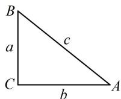

> [!faq]- 《3代数式的恒等变形》参考答案
>
> > [!success]- **【答案】** ABC
>
> > [!note]- **【分析】**
> > 本题未单列分析。
>
> > [!note]- **【解析】**
> > ABC
> >
> > 解法1：A项，题干给出3个条件，观察发现在 $\cos 2A+$
> >
> > $\cos 2B + 2\sin C = 2$ 这个条件中对 $\cos 2A$ 和 $\cos 2B$ 用二倍角公式，可产生此项结论中的 $\sin^2 A$ ， $\sin^2 B$ ，故尝试按此变形，因为 $\cos 2A + \cos 2B + 2\sin C = 2$ ，
> >
> > $$
> > 1 - 2 \sin^ {2} A + 1 - 2 \sin^ {2} B + 2 \sin C = 2
> > $$
> >
> > 化简得： $\sin C = \sin^2 A + \sin^2 B$ ，故A项正确；
> >
> > B项，此项结论与边有关，考虑角化边，从哪里切入？现已得到 $\sin C = \sin^2 A + \sin^2 B$ ，若是齐次式 $\sin^2 C = \sin^2 A + \sin^2 B$ ，则可用正弦定理化边，但这里不齐次，怎么办呢？可考虑通过放缩使其齐次，
> >
> > 因为 $C \in (0, \pi)$ ，所以 $0 < \sin C \leq 1$ ，由前面的分析可知 $\sin^2 A + \sin^2 B = \sin C \geq \sin^2 C$ ，所以 $a^2 + b^2 \geq c^2$
> >
> > 从而 $a^2 + b^2 - c^2 \geq 0$ ，故 $\cos C = \frac{a^2 + b^2 - c^2}{2ab} \geq 0$
> >
> > 结合 $C\in (0,\pi)$ 可得 $0 < C\leq \frac{\pi}{2}$
> >
> > 上述结果怎么用？我们发现 $C$ 有可能为 $\frac{\pi}{2}$ ，这一情况比较特殊，于是我们再分 $0 < C < \frac{\pi}{2}$ 和 $C = \frac{\pi}{2}$ 分别考虑，
> >
> > 若 $0 < C < \frac{\pi}{2}$ ，则结合 $A + B = \pi - C$ 可得 $\frac{\pi}{2} < A + B < \pi$
> >
> > 所以 $A > \frac{\pi}{2} - B$ ， $B > \frac{\pi}{2} - A$ ，又 $\cos A\cos B\sin C = \frac{1}{4} >0$
> >
> > 且 $\sin C > 0$ ，所以 $\cos A\cos B > 0$ ，故 $\cos A$ 与 $\cos B$ 同号，
> >
> > 由于 $\triangle ABC$ 最多只有一个钝角，即最多只有一个内角余弦值为负，所以 $\cos A$ 与 $\cos B$ 只能同正，故 $A, B$ 都是锐角，所以 $\frac{\pi}{2} - A$ ， $\frac{\pi}{2} - B$ 也都为锐角，
> >
> > 结合 $A > \frac{\pi}{2} - B$ ， $B > \frac{\pi}{2} - A$ 得 $\sin A > \sin \left(\frac{\pi}{2} - B\right) = \cos B$
> >
> > $$
> > \sin B > \sin \left(\frac {\pi}{2} - A\right) = \cos A,
> > $$
> >
> > 所以 $\sin C = \sin^2 A + \sin^2 B > \sin A\cos B + \sin B\cos A$
> >
> > $= \sin (A + B) = \sin (\pi -C) = \sin C$ ，矛盾，故只能 $C = \frac{\pi}{2}$
> >
> > 此时 $\sin C = 1$ ，且 $B = \pi -A - C = \frac{\pi}{2} -A$
> >
> > 所以 $\sin^2 A + \sin^2 B = \sin^2 A + \sin^2\left(\frac{\pi}{2} -A\right)$
> >
> > $= \sin^2 A + \cos^2 A = 1 = \sin C$ ，满足要求，
> >
> > 有了角 $C$ ，怎样求 $AB$ ？条件所给面积能与边长联系起来，故又来翻译它，记 $A, B, C$ 所对的边分别为 $a, b, c,$
> >
> > 由题意， $S_{\triangle ABC} = \frac{1}{2} ab = \frac{1}{4}\Rightarrow ab = \frac{1}{2},$
> >
> > 有了 $ab$ ，若能求出 $\sin A\sin B$ ，就能按 $\frac{c^2}{\sin^2C} = \frac{ab}{\sin A\sin B}$ 求 $c$ ，观察发现由题设条件容易求 $\cos A\cos B$ ，而 $C = \frac{\pi}{2}$ ，于是 $A + B = \frac{\pi}{2}$ 由此可将 $\cos A\cos B$ 换算成 $\sin A\sin B$ 将 $C = \frac{\pi}{2}$ 代入 $\cos A\cos B\sin C = \frac{1}{4}$ 可得 $\cos A\cos B = \frac{1}{4}$ 又 $A + B = \pi -C = \frac{\pi}{2}$ ，所以 $A = \frac{\pi}{2} -B$ ， $B = \frac{\pi}{2} -A$ 故 $\cos A\cos B = \cos \left(\frac{\pi}{2} -B\right)\cos \left(\frac{\pi}{2} -A\right) = \sin B\sin A$ 所以 $\sin A\sin B = \cos A\cos B = \frac{1}{4}$ 由正弦定理， $\frac{a}{\sin A} = \frac{b}{\sin B} = \frac{c}{\sin C} = 2R$ 其中 $R$ 为△ABC的外接圆半径，
> >
> > 所以 $\frac{c^2}{\sin^2C} = 4R^2 = \frac{a}{\sin A}\cdot \frac{b}{\sin B} = \frac{ab}{\sin A\sin B} = \frac{\frac{1}{2}}{\frac{1}{4}} = 2$
> >
> > 从而 $c^2 = 2\sin^2 C = 2$ ，故 $c = \sqrt{2}$ ，即 $AB = \sqrt{2}$
> >
> > 故B项正确；
> >
> > C项，已有 $A$ ， $B$ 的关系，不妨考虑把 $\sin A + \sin B$ 消元，再看如何计算它，由前面的分析可知， $B = \frac{\pi}{2} -A$
> >
> > 所以 $\sin A + \sin B = \sin A + \sin \left(\frac{\pi}{2} - A\right)$
> >
> > $$
> > = \sin A + \cos A = \sqrt {(\sin A + \cos A) ^ {2}}
> > $$
> >
> > $$
> > = \sqrt {\sin^ {2} A + \cos^ {2} A + 2 \sin A \cos A} = \sqrt {1 + 2 \sin A \cos A} \quad (1),
> > $$
> >
> > 故只需求 $\sin A\cos A$ ，已有 $\sin A\sin B$ ，将 $\sin B$ 换成 $\cos A$ ，就能得到 $\sin A\cos A$
> >
> > 因为 $\sin A\sin B = \sin A\sin \left(\frac{\pi}{2} -A\right) = \sin A\cos A = \frac{1}{4}$ ，所以代入①得 $\sin A + \sin B = \sqrt{1 + 2\times\frac{1}{4}} = \frac{\sqrt{6}}{2}$ ，故C项正确；
> >
> > D 项，因为 $C = \frac{\pi}{2}$ ，所以 $AC^2 + BC^2 = AB^2 = 2 \neq 3$
> >
> > 故D项错误.
> >
> > 解法2: A、D两项的判断和B项得到 $C=\frac{\pi}{2}$ 和 $ab=\frac{1}{2}$ 的过程同解法1,再看最后一个条件 $\cos A\cos B\sin C=\frac{1}{4}$ ,由于已有 $\triangle ABC$ 是直角三角形,故也可直接用边来翻译此条件,看能否结合 $ab=\frac{1}{2}$ 求出AB,
> >
> > 在 $\triangle ABC$ 中，因为 $C = \frac{\pi}{2}$ ，所以如图，
> >
> > $$
> > \cos A \cos B \sin C = \frac {b}{c} \times \frac {a}{c} \times 1 = \frac {a b}{c ^ {2}}
> > $$
> >
> > 又由题意， $\cos A\cos B\sin C = \frac{1}{4}$ ，所以 $\frac{ab}{c^2} = \frac{1}{4}$
> >
> > 结合 $ab = \frac{1}{2}$ 可得 $c = \sqrt{2}$ ，即 $AB = \sqrt{2}$ ，故B项正确；
> >
> > 对于 C 项，由于结论中涉及的量都容易用边表示，故也可考虑先用边表示，再作分析，
> >
> > $$
> > \sin A + \sin B = \frac {a}{c} + \frac {b}{c} = \frac {a + b}{c} = \frac {a + b}{\sqrt {2}},
> > $$
> >
> > 又 $a^2 + b^2 = c^2 = 2$ ，所以 $a + b = \sqrt{(a + b)^2}$
> >
> > $$
> > = \sqrt {a ^ {2} + b ^ {2} + 2 a b} = \sqrt {2 + 2 \times \frac {1}{2}} = \sqrt {3}
> > $$
> >
> > 从而 $\sin A + \sin B = \frac{a + b}{\sqrt{2}} = \frac{\sqrt{3}}{\sqrt{2}} = \frac{\sqrt{6}}{2}$ ，故C项正确.
> >
> > 
