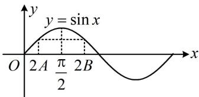
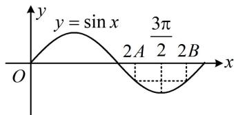

> [!faq]- 《3代数式的恒等变形》例题解析
>
> > [!success]- **【答案】** AC
>
> > [!note]- **【分析】**
> > 本题未单列分析。
>
> > [!note]- **【解析】**
> > A. 若 $\frac{a}{\cos A} = \frac{b}{\cos B} = \frac{c}{\cos C}$ ，则 $\triangle ABC$ 一定是等边三角形
> > B. 若 $a \cos A = b \cos B$ ，则 $\triangle ABC$ 一定是等腰三角形
> > C. 若 $b \cos C + c \cos B = b$ ，则 $\triangle ABC$ 一定是等腰三角形
> > D. 若 $a^2 + b^2 - c^2 > 0$ ，则 $\triangle ABC$ 一定是锐角三角形
> >
> > 解析：A 项，所给等式每一项都有齐次的边，可考虑用正弦定理边化角分析，因为 $\frac{a}{\cos A} = \frac{b}{\cos B} = \frac{c}{\cos C}$ ，所以 $\frac{\sin A}{\cos A} = \frac{\sin B}{\cos B} = \frac{\sin C}{\cos C}$ ，故 $\tan A = \tan B = \tan C$ ，又 $A, B, C \in (0, \pi)$ ，所以 $A = B = C$ ，从而 $\triangle ABC$ 一定是正三角形，故 A 项正确；B 项，因为 $a \cos A = b \cos B$ ，所以 $\sin A \cos A = \sin B \cos B$ ，故 $\sin 2A = \sin 2B$ ，
> >
> > 因为 $A, B \in (0, \pi)$ ，所以 $2A, 2B \in (0, 2\pi)$ ，从而 $2A = 2B$ 或 $2A + 2B = \pi$ （如图1）或 $2A + 2B = 3\pi$ （如图2），故 $A = B$ 或 $A + B = \frac{\pi}{2}$ 或 $A + B = \frac{3\pi}{2}$ （舍去），
> >
> > 若 $A = B$ ，则 $\triangle ABC$ 是等腰三角形；若 $A + B = \frac{\pi}{2}$ ，则 $C = \pi -(A + B) = \frac{\pi}{2}$ ，所以 $\triangle ABC$ 是直角三角形；
> >
> > 从而 $\triangle ABC$ 是等腰三角形或直角三角形，故B项错误；
> >
> > C 项，因为 $b \cos C + c \cos B = b$ ，所以 $\sin B \cos C + \sin C \cos B = \sin B$ ，故 $\sin(B + C) = \sin B$ ，
> >
> > 又 $\sin (B + C) = \sin (\pi -A) = \sin A$ ，所以 $\sin A = \sin B$ ，故 $a = b$ ，所以 $\triangle ABC$ 一定是等腰三角形，故C项正确；D项，看到 $a^2 +b^2 -c^2$ 这一结构，想到余弦定理推论， $a^2 +b^2 -c^2 >0\Rightarrow \cos C = \frac{a^2 + b^2 - c^2}{2ab} >0$
> >
> > 结合 $0 < C < \pi$ 得 $C$ 为锐角，但 $A$ 和 $B$ 的情况无法判断，所以 $\triangle ABC$ 不一定是锐角三角形，故D项错误.
> >
> >
> >   
> > 图1
> >
> >   
> > 图2
>
> > [!tip]- **【总结】**
> > 判断三角形形状时，若出现边角混合等式，考虑的方向和之前所学一样，不外乎边化角，寻找角的关系；或角化边，分析边的关系.
