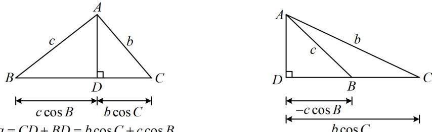

<!-- source-part:1 pages:1-7 -->

  
$a = CD + BD = b\cos C + c\cos B$

# 模块三 几何问题篇

## 第1节 射影定理、几何计算（★★★）

内容提要

1. 射影定理：在 $\triangle ABC$ 中， $\left\{ \begin{array}{l} a = b \cos C + c \cos B \\ b = a \cos C + c \cos A \\ c = a \cos B + b \cos A \end{array} \right.$

提醒：大题不建议直接用射影定理，可先证再用，下面给出 $a = b\cos C + c\cos B$ 的证明. 因为 $\sin A = \sin [\pi - (B + C)] = \sin (B + C) = \sin B\cos C + \cos B\sin C$ ，所以 $a = b\cos C + c\cos B$

上式的图形解释如下图，另外两个式子可类似证明，本节后续解答过程若用到此定理，不再证明.

2. 几何计算：遇到不便于直接解的解三角形问题，往往可设长度或角度为参数，用设的参数表示目标，或通过分析图形的几何关系来建立方程，求解问题.

![[高中/总复习/教辅/一数常规版2026/第5章 解三角形/模块3：几何问题篇/1射影定理、几何计算/类型01_射影定理的应用/类型01_射影定理的应用.md]]
![[高中/总复习/教辅/一数常规版2026/第5章 解三角形/模块3：几何问题篇/1射影定理、几何计算/类型02_几何综合计算/类型02_几何综合计算.md]]
![[高中/总复习/教辅/一数常规版2026/第5章 解三角形/模块3：几何问题篇/1射影定理、几何计算/强化训练/强化训练.md]]
