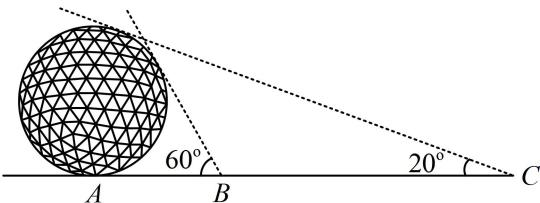

<!-- question-source:start -->
## 3. (2023·江苏省苏北七市二调·★★★)

古代数学家刘徽编撰的《重差》是中国最早的一部测量学著作，也为地图学提供了数学基础。现根据刘徽的《重差》测量一个球体建筑物的高度，已知点 $A$ 是球体建筑物与水平地面的接触点（切点），地面上 $B$ ， $C$ 两点与点 $A$ 在同一条直线上，且在点 $A$ 的同侧。若在 $B$ ， $C$ 处分别测得球体建筑物的最大仰角为 $60^{\circ}$ 和 $20^{\circ}$ ，且 $BC = 100\mathrm{m}$ ，则该球体建筑物的高度约为（）（ $\cos 10^{\circ} \approx 0.985$ ）。  
A. $49.25\mathrm{m}$ B. $50.76\mathrm{m}$ C. $56.74\mathrm{m}$ D. $58.60\mathrm{m}$

<!-- question-source:end -->

![[Q00050709A1]]
