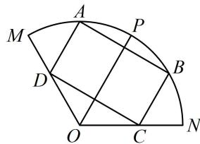

<!-- question-source:start -->
7.（2023·四川模拟·★★★☆）

如图，在扇形 $MON$ 中， $ON = 3$ ， $\angle MON = \frac{2\pi}{3}$ ， $\angle MON$ 的平分线交扇形弧于点 $P$ ，点 $A$ 是扇形弧 $PM$ 上一点（不包括端点），过 $A$ 作 $OP$ 的垂线交扇形弧于另一点 $B$ ，分别过 $A$ ， $B$ 作 $OP$ 的平行线，交 $OM$ ， $ON$ 于点 $D$ ， $C$ .

（1）若 $\angle AOB = \frac{\pi}{3}$ ，求 $AD$

（2）设 $\angle AOP = x$ ， $x\in \left(0,\frac{\pi}{3}\right)$ ，求四边形ABCD的面积的最大值.

一数·必刷100讲
<!-- question-source:end -->

![[Q00050712A1]]
