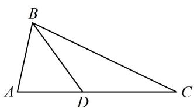

<!-- question-source:start -->
4. (★★★)

如图， $\triangle ABC$ 中， $D$ 是边 $AC$ 上的点， $AB = AD$ ， $2AB = \sqrt{3} BD$ ， $BC = 2BD$ ，则 $\sin C = (\quad)$ A. $\frac{\sqrt{3}}{3}$ B. $\frac{\sqrt{3}}{6}$ C. $\frac{\sqrt{6}}{3}$ D. $\frac{\sqrt{6}}{6}$

（2024·新疆乌鲁木齐一模·★★★☆）
<!-- question-source:end -->

![[Q00051034A1]]
