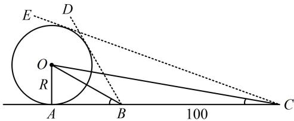

> [!faq]- 《1射影定理、几何计算》参考答案
>
> > [!success]- **【答案】** B
>
> > [!note]- **【分析】**
> > 本题未单列分析。
>
> > [!note]- **【解析】**
> > 解析：建筑物的高度即为球的直径 $2R$ ，不妨先画出过球心的截面，并标出已知条件，再分析，如图，由题意， $BC = 100\mathrm{m}$ ， $\angle ABD = 60^{\circ}$ ， $\angle ACE = 20^{\circ}$ ，所以 $\angle ABO = 30^{\circ}$ ， $\angle BCO = 10^{\circ}$
> >
> > 已知 $\angle ABO$ ，只要求出 Rt $\triangle AOB$ 的任何一边，都能求 $R$ 。观察发现 $\triangle OBC$ 各内角都好求，又有 $BC$ ，故可由正弦定理求 $OB$ ，在 $\triangle OBC$ 中， $\angle BOC = \angle ABO - \angle BCO = 20^{\circ}$ ，由正弦定理， $\frac{OB}{\sin\angle BCO} = \frac{BC}{\sin\angle BOC}$ ，所以 $OB = \frac{BC \cdot \sin\angle BCO}{\sin\angle BOC} = \frac{100\sin 10^{\circ}}{\sin 20^{\circ}} = \frac{100\sin 10^{\circ}}{2\sin 10^{\circ}\cos 10^{\circ}} = \frac{50}{\cos 10^{\circ}}$ 故 $R = OA = OB \cdot \sin \angle ABO = \frac{50}{\cos 10^{\circ}} \times \sin 30^{\circ} = \frac{25}{\cos 10^{\circ}}$ $\approx \frac{25}{0.985} \approx 25.38\mathrm{m}$ ，故球体建筑物的高度为 $2R \approx 50.76\mathrm{m}$
> >
> > 
