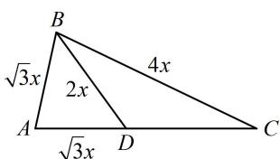

> [!faq]- 《1射影定理、几何计算》参考答案
>
> > [!success]- **【答案】** D
>
> > [!note]- **【分析】**
> > 本题未单列分析。
>
> > [!note]- **【解析】**
> > 解析：分析已知条件可发现诸多线段都与 $AB$ 有关系，先把 $AB$ 设成未知数，并表示其他线段，设 $AB = \sqrt{3} x$ ，则 $AD = \sqrt{3} x$ ， $BD = 2x$ ， $BC = 4x$ ，
> >
> > 如图, 已知 $\triangle ABD$ 的三边比例, 可先在 $\triangle ABD$ 中求 $A$ , 再到 $\triangle ABC$ 中由正弦定理求 $\sin C$
> >
> > 在 $\triangle ABD$ 中，由余弦定理推论， $\cos A = \frac{AB^2 + AD^2 - BD^2}{2AB\cdot AD}$
> >
> > $= \frac{1}{3}$ ，又 $0 < A < \pi$ ，所以 $\sin A = \sqrt{1 - \cos^2 A} = \frac{2\sqrt{2}}{3}$
> >
> > 在 $\triangle ABC$ 中，由正弦定理， $\frac{AB}{\sin C} = \frac{BC}{\sin A}$
> >
> > 所以 $\sin C = \frac{AB\cdot\sin A}{BC} = \frac{\sqrt{3}x\cdot\frac{2\sqrt{2}}{3}}{4x} = \frac{\sqrt{6}}{6}$
> >
> > 
