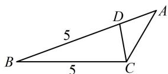

> [!faq]- 《1射影定理、几何计算》参考答案
>
> > [!success]- **【答案】** 详见解析
>
> > [!note]- **【分析】**
> > 本题未单列分析。
>
> > [!note]- **【解析】**
> > 解：（1）（条件等式各项都有齐次的边，且所求为角，故考虑用正弦定理边化角分析）因为 $c\cos B + 3b\cos C = a - b$ 所以 $\sin C\cos B + 3\sin B\cos C = \sin A - \sin B$ ①，（式①变量较多，可考虑用内角和为 $\pi$ 来消元。注意到左边有 $\sin C\cos B$ 和 $\sin B\cos C$ ，所以消 $A$ 可进一步化简） $\sin A = \sin [\pi - (B + C)] = \sin (B + C)$ $= \sin B\cos C + \cos B\sin C$ ②，代入①得 $\sin C\cos B + 3\sin B\cos C = \sin B\cos C+$ $\cos B\sin C - \sin B$ ，化简得： $2\sin B\cos C = -\sin B$ ③，又 $0 < B < \pi$ ，所以 $\sin B > 0$ ，故在式③中约去 $\sin B$ 可得 $2\cos C = -1$ ，故 $\cos C = -\frac{1}{2}$ ，结合 $0 < C < \pi$ 可得 $C = \frac{2\pi}{3}$ （2）（如图，已知 $B$ 和 $C$ ，则 $A$ 容易由内角和为 $\pi$ 求出，故求 $S_{\triangle ACD}$ 考虑用角 $A$ )因为 $\cos B = \frac{13}{14}$ ，所以 $B$ 为锐角，且 $\sin B = \sqrt{1 - \cos^2B} = \frac{3\sqrt{3}}{14}$ ，代入②结合 $C = \frac{2\pi}{3}$ 可得 $\sin A = \frac{3\sqrt{3}}{14}\times \left(-\frac{1}{2}\right) + \frac{13}{14}\times \frac{\sqrt{3}}{2} = \frac{5\sqrt{3}}{14},$ （求 $S_{\triangle ACD}$ 还差边 $AC$ 和 $AD$ ，到此△ABC已知三角一边，可先由正弦定理求得 $b$ 和 $c$ ，那么 $AC$ 和 $AD$ 也就有了）由正弦定理， $\frac{a}{\sin A} = \frac{b}{\sin B} = \frac{c}{\sin C},$ 所以 $\frac{5}{\frac{5\sqrt{3}}{14}} = \frac{b}{\frac{3\sqrt{3}}{14}} = \frac{c}{\frac{\sqrt{3}}{2}}$ ，解得： $b = 3$ ， $c = 7,$ 所以 $AD = c - BD = 7 - 5 = 2,$ 故 $S_{\triangle ACD} = \frac{1}{2} AD\cdot AC\cdot \sin A = \frac{1}{2}\times 2\times 3\times \frac{5\sqrt{3}}{14} = \frac{15\sqrt{3}}{14}.$
> >
> > 
