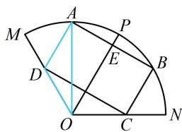

> [!faq]- 《1射影定理、几何计算》参考答案
>
> > [!success]- **【答案】** 详见解析
>
> > [!note]- **【分析】**
> > 本题未单列分析。
>
> > [!note]- **【解析】**
> > 解：（1）（如图，要求 $AD$ ，可到 $\triangle AOD$ 中考虑，先分析哪
> >
> > 些量是已知的）由 $\angle AOB = \frac{\pi}{3}$ 可得 $\angle AOP = \frac{\pi}{6}$ ，
> >
> > $\angle AOD = \frac{\pi}{6}$ ，又 $AD / / OP$ ，所以 $\angle ADM = \angle POM = \frac{\pi}{3}$
> >
> > 故 $\angle ADO = \frac{2\pi}{3}$ ， $OA = ON = 3$ ，（此时可发现 $\triangle AOD$ 中，已知和要求的刚好是两边两对角，故用正弦定理求 $AD$ ）
> >
> > 在 $\triangle AOD$ 中，由正弦定理， $\frac{AD}{\sin\angle AOD} = \frac{OA}{\sin\angle ADO}$
> >
> > 所以 $AD = \frac{OA\cdot\sin\angle AOD}{\sin\angle ADO} = \frac{3\sin\frac{\pi}{6}}{\sin\frac{2\pi}{3}} = \sqrt{3}$
> >
> > (2) (由图可知四边形 $ABCD$ 是矩形, 求面积关键是算 $AD$ 和 $AB$ , $AD$ 算法和第 (1) 问相同)
> >
> > $$
> > \angle A O P = x
> > $$
> >
> > $$
> > \angle A O D = \frac {\pi}{3} - x
> > $$
> >
> > 在 $\triangle AOD$ 中，由正弦定理， $\frac{AD}{\sin\angle AOD} = \frac{OA}{\sin\angle ADO}$
> >
> > 所以 $AD = \frac{OA\cdot\sin\angle AOD}{\sin\angle ADO} = \frac{3\sin\left(\frac{\pi}{3} - x\right)}{\sin\frac{2\pi}{3}} = 2\sqrt{3}\sin \left(\frac{\pi}{3} -x\right),$
> >
> > (再求 $AB$ , 如图, 可先在 $\triangle AOE$ 中求 $AE$ )
> >
> > 设 $AB$ 与 $OP$ 交于点 $E$ ，则由对称性可知 $E$ 为 $AB$ 的中点，在 $\triangle AOE$ 中， $AE = OA\cdot \sin \angle AOE = 3\sin x$ ，所以 $AB = 2AE = 6\sin x$ 故矩形ABCD的面积 $S = AD\cdot AB = 2\sqrt{3}\sin \left(\frac{\pi}{3} -x\right)\cdot 6\sin x$ $= 2\sqrt{3}\left(\frac{\sqrt{3}}{2}\cos x - \frac{1}{2}\sin x\right)\cdot 6\sin x = (3\cos x - \sqrt{3}\sin x)\cdot 6\sin x$ $= 18\sin x\cos x - 6\sqrt{3}\sin^2 x = 9\sin 2x - 6\sqrt{3}\cdot \frac{1 - \cos 2x}{2}$ $= 9\sin 2x + 3\sqrt{3}\cos 2x - 3\sqrt{3} = 3(3\sin 2x + \sqrt{3}\cos 2x - \sqrt{3})$ $= 3\left[2\sqrt{3}\sin \left(2x + \frac{\pi}{6}\right) - \sqrt{3}\right],$
> >
> > 因为 $x \in \left(0, \frac{\pi}{3}\right)$ ，所以 $2x + \frac{\pi}{6} \in \left(\frac{\pi}{6}, \frac{5\pi}{6}\right)$ ，
> >
> > 故当 $2x + \frac{\pi}{6} = \frac{\pi}{2}$ 时， $S$ 取得最大值 $3\sqrt{3}$
> >
> > 
> >
> > 一数·必刷100讲
