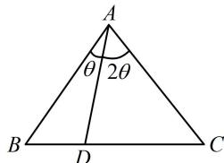

> [!faq]- 《1射影定理、几何计算》参考答案
>
> > [!success]- **【答案】** B
>
> > [!note]- **【分析】**
> > 本题未单列分析。
>
> > [!note]- **【解析】**
> > B
> >
> > 解法1：条件 $\overrightarrow{AD} = \frac{2}{3}\overrightarrow{AB} +\frac{1}{3}\overrightarrow{AC}$ 怎样处理？可用它确定点 $D$ 的位置.注意到该式右边系数和为1，所以 $D$ 必在 $BC$ 上．为了确定其具体位置，可考虑将左边也按右边的系数进行拆分，再重组化简，由 $\overrightarrow{AD} = \frac{2}{3}\overrightarrow{AB} +\frac{1}{3}\overrightarrow{AC}$ 可得 $\frac{2}{3}\overrightarrow{AD} +\frac{1}{3}\overrightarrow{AD} = \frac{2}{3}\overrightarrow{AB} +\frac{1}{3}\overrightarrow{AC}$ ，所以 $\frac{2}{3} (\overrightarrow{AD} -\overrightarrow{AB}) = \frac{1}{3} (\overrightarrow{AC} -\overrightarrow{AD})$ ，故 $2\overrightarrow{BD} = \overrightarrow{DC}$ ，如图，观察选项，怎样能把 $\sin B$ ， $\sin C$ 和 $\sin \theta$ ， $\cos \theta$ 联系起来？既然涉及了这么多正弦值，当然考虑正弦定理，在△ABD中，由正弦定理， $\frac{BD}{\sin\theta} = \frac{AD}{\sin B}$ 同理，在△ACD中， $\frac{CD}{\sin 2\theta} = \frac{AD}{\sin C}$ 两式相除得： $\frac{BD\cdot\sin 2\theta}{CD\cdot\sin\theta} = \frac{\sin C}{\sin B}$ 由 $2\overrightarrow{BD} = \overrightarrow{DC}$ 可得 $\frac{BD}{CD} = \frac{1}{2}$ ，所以 $\frac{\sin 2\theta}{2\sin\theta} = \frac{\sin C}{\sin B}$ 从而 $\frac{2\sin\theta\cos\theta}{2\sin\theta} = \frac{\sin C}{\sin B}$ ，故 $\sin C = \cos \theta \sin B$ ：
> >
> > 
> >
> > 解法2：得到 $2\overrightarrow{BD}=\overrightarrow{DC}$ 的过程同解法1，接下来若注意到由 $2\overrightarrow{BD}=\overrightarrow{DC}$ 可求出 $\triangle ABD$ 和 $\triangle ACD$ 的面积之比，而这一比值也能用AB，AD，AC， $\theta$ 来表示，则可由此建立关于 $\theta$ 的方程，再看它与选项的关联，
> > 设 $\triangle ABC$ 的 BC 边上的高为 h，则 $\frac{S_{\triangle ABD}}{S_{\triangle ACD}}=\frac{\frac{1}{2}BD\cdot h}{\frac{1}{2}CD\cdot h}=\frac{BD}{CD}=\frac{1}{2}$ 又因为 $\frac{S_{\triangle ABD}}{S_{\triangle ACD}}=\frac{\frac{1}{2}AB\cdot AD\cdot\sin\theta}{\frac{1}{2}AC\cdot AD\cdot\sin2\theta}=\frac{AB\cdot\sin\theta}{AC\cdot2\sin\theta\cos\theta}$ $=\frac{AB}{2AC\cdot\cos\theta}$ 所以 $\frac{AB}{2AC\cdot\cos\theta}=\frac{1}{2}$ ，故 $\frac{AB}{AC\cdot\cos\theta}=1$ ①，
> > 选项皆为角的关系，故考虑把 $\frac{AB}{AC}$ 这一边的齐次分式在 $\triangle ABC$ 中用正弦定理边化角，
> > 因为 $\frac{AB}{AC}=\frac{\sin C}{\sin B}$ ，所以代入①得 $\frac{\sin C}{\sin B\cos\theta}=1$ 故 $\sin C=\cos\theta\sin B$ .
