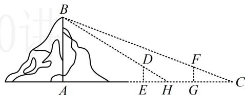

<!-- question-source:start -->
【变式3】(2021·全国乙卷) 魏晋时期刘徽撰写的《海岛算经》是关于测量的数学著作, 其中第一题是测量海岛的高, 如图, 点 $E$ , $H$ , $G$ 在水平线 $AC$ 上, $DE$ 和 $FG$ 是两个垂直于水平面且等高的测量标杆的高度, 称为 “表高”, $EG$ 称为 “表距”, $GC$ 和 $EH$ 都称为 “表目距”, $GC$ 与 $EH$ 的差称为 “表目距的差”, 则海岛的高 $AB = (\quad)$ A. $\frac{\text{表高} \times \text{表距}}{\text{表目距的差}} + \text{表高}$ B. $\frac{\text{表高} \times \text{表距}}{\text{表目距的差}} - \text{表高}$ C. $\frac{\text{表高} \times \text{表距}}{\text{表目距的差}} + \text{表距}$ D. $\frac{\text{表高} \times \text{表距}}{\text{表目距的差}} - \text{表距}$

<!-- question-source:end -->

![[高中/总复习/教辅/一数常规版2026/第5章 解三角形/模块3：几何问题篇/1射影定理、几何计算/类型02_几何综合计算/例题/answers/Q00050706A1.md]]
