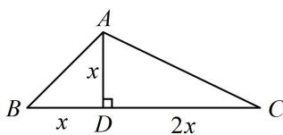

> [!faq]- 《1射影定理、几何计算》例题解析
>
> > [!success]- **【答案】** C
>
> > [!note]- **【分析】**
> > 本题未单列分析。
>
> > [!note]- **【解析】**
> > 解析：题干涉及 $BC$ 边上的高，先画出图形，作出该高，并分析几何关系，
> >
> > 如图， $B=\frac{\pi}{4}\Rightarrow\triangle ABD$ 为等腰直角三角形 $\Rightarrow AD=BD$ ，又 BC 边上的高 $AD=\frac{1}{3}BC$ ，所以 CD=2AD，
> >
> > 设 $AD = x$ ，则 $BD = x$ ， $CD = 2x$ ， $AB = \sqrt{2} x$ ， $AC = \sqrt{AD^2 + CD^2} = \sqrt{5} x$ ， $BC = 3x$ ，所以 $\cos A = \frac{AB^2 + AC^2 - BC^2}{2AB\cdot AC} = \frac{2x^2 + 5x^2 - 9x^2}{2\sqrt{2}x\cdot\sqrt{5}x} = -\frac{\sqrt{10}}{10}$
> >
> > 
>
> > [!tip]- **【反思】**
> > 对于几何计算问题，当出现未知长度或角度时，可以设出对应边长或者角度作为参数，再把其它量用参数表示，最后利用几何关系算出要求的几何问题.
