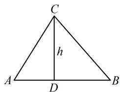

> [!faq]- 《1射影定理、几何计算》例题解析
>
> > [!success]- **【答案】** 详见解析
>
> > [!note]- **【分析】**
> > 本题未单列分析。
>
> > [!note]- **【解析】**
> > 解：
> > 由 $\triangle ABC$ 是锐角三角形可得 $A + B = \pi - C \in \left(\frac{\pi}{2}, \pi\right)$ ，又 $\sin(A + B) = \frac{3}{5}$ ，所以 $\cos(A + B) = -\sqrt{1 - \left(\frac{3}{5}\right)^2} = -\frac{4}{5}$ ，从而 $\tan(A + B) = -\frac{3}{4}$ ，故 $\frac{\tan A + \tan B}{1 - \tan A \tan B} = -\frac{3}{4}$ ，将 $\tan A = 2 \tan B$ 代入上式整理得： $2 \tan^2 B - 4 \tan B - 1 = 0$ ，解得： $\tan B = \frac{2 \pm \sqrt{6}}{2}$ ，又 $B$ 为锐角，所以 $\tan B > 0$ ，故 $\tan B = \frac{2 + \sqrt{6}}{2}$ ， $\tan A = 2 \tan B = 2 + \sqrt{6}$ ，
> >
> > (有了 A 和 B, 怎样求高? 我们不妨画个图来看看. 如图, 已有 A 和 B, 则 AD 和 BD 容易用高 h 表示, 而 $AD + BD = AB$ , 故由此可建立方程求 h)
> >
> > 设 $AB$ 边上的高 $CD = h$ ，则 $AB = AD + DB = \frac{CD}{\tan A} + \frac{CD}{\tan B} = \frac{h}{2 + \sqrt{6}} + \frac{h}{\frac{2 + \sqrt{6}}{2}} = \frac{3h}{2 + \sqrt{6}}$ ，由题意， $AB = 3$ ，所以 $\frac{3h}{2 + \sqrt{6}} = 3$ ，解得： $h = 2 + \sqrt{6}$ ，故 $AB$ 边上的高为 $2 + \sqrt{6}$ .
> >
> > 
> >
> > 解法2: (如图, 第
> > 解法3：（按解法2求得 $\sin C = \frac{3}{5}$ 后，注意到已知 $AB, AC$ ，结合图形可知 $\sin B$ 也容易用 $h$ 表示，故接下来也可考虑用正弦定理建立关于 $h$ 的方程并求解）由图可知 $\sin B = \frac{CD}{BC} = \frac{h}{\sqrt{h^2 + 4}}$ ，由正弦定理， $\frac{AB}{\sin C} = \frac{AC}{\sin B}$ ，即 $\frac{3}{\frac{3}{5}} = \frac{\sqrt{h^2 + 1}}{\frac{h}{\sqrt{h^2 + 4}}}$ ，所以 $\sqrt{h^2 + 1} = \frac{5h}{\sqrt{h^2 + 4}}$ 从而 $(h^2 + 1)(h^2 + 4) = 25h^2$ ，故 $h^4 - 20h^2 + 4 = 0$ ，接下来同解法2.
>
> > [!tip]- **【反思】**
> > 本题尽管计算量更大，且三个解法的具体操作方法不同，但思路其实大体相同，都是设出未知数，再利用几何关系建立方程求解所设未知数。“设参数、列方程”就是几何计算问题的核心流程.
