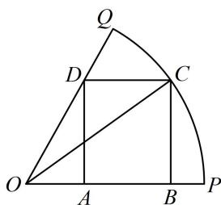

> [!faq]- 《1射影定理、几何计算》例题解析
>
> > [!success]- **【答案】** 详见解析
>
> > [!note]- **【分析】**
> > 本题未单列分析。
>
> > [!note]- **【解析】**
> > 解析：矩形 $ABCD$ 的面积由点 $C$ 的位置决定, 而点 $C$ 的位置由 $\angle POC$ 决定, 故可引入 $\angle POC$ 为变量，设 $\angle POC = \alpha \left(0 < \alpha < \frac{\pi}{3}\right)$ ，则 $BC = OC \cdot \sin \alpha = \sin \alpha$ ， $AD = BC = \sin \alpha$ ， $OB = OC \cdot \cos \alpha = \cos \alpha$ ， $OA = \frac{AD}{\tan \angle AOD} = \frac{\sin \alpha}{\tan \frac{\pi}{3}} = \frac{\sqrt{3}}{3} \sin \alpha$ ，所以 $AB = OB - OA = \cos \alpha - \frac{\sqrt{3}}{3} \sin \alpha$ ，故矩形的面积 $S = AB \cdot BC = \left(\cos \alpha - \frac{\sqrt{3}}{3} \sin \alpha\right) \sin \alpha = \frac{1}{2} \sin 2\alpha - \frac{\sqrt{3}}{3} \cdot \frac{1 - \cos 2\alpha}{2} = \frac{\sqrt{3}}{3} \sin \left(2\alpha + \frac{\pi}{6}\right) - \frac{\sqrt{3}}{6}$ ，因为 $0 < \alpha < \frac{\pi}{3}$ ，所以 $\frac{\pi}{6} < 2\alpha + \frac{\pi}{6} < \frac{5\pi}{6}$ ，故当 $2\alpha + \frac{\pi}{6} = \frac{\pi}{2}$ 时， $S$ 取得最大值 $\frac{\sqrt{3}}{6}$ 。答案： $\frac{\sqrt{3}}{6}$
> >
> > 
>
> > [!tip]- **【反思】**
> > 变量函数思想是求最值的基本思想之一，引入变量的方法不是唯一的，例如本题设的是角度，其实也可设 $BC = x$ ，但由此得出的面积表达式较复杂，不易求最值，所以在选取变量时，应预判计算量.
