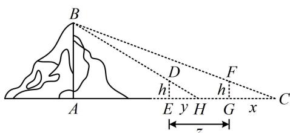

> [!faq]- 《1射影定理、几何计算》例题解析
>
> > [!success]- **【答案】** A
>
> > [!note]- **【分析】**
> > 本题未单列分析。
>
> > [!note]- **【解析】**
> > 解法1：为了方便观察，先把题干涉及到的线段设成字母，并在图中标注出来，
> > 如图，设表目距CG=x，表目距EH=y，表距EG=z，表高DE=FG=h，
> > 从图形来看，有两组三角形相似，可用相似比建立这些边长的关系，
> > 因为 $\triangle FGC\sim\triangle BAC$ ，所以 $\frac{FG}{AB}=\frac{CG}{AC}$ ，故 $\frac{h}{AB}=\frac{x}{x+z+AE}$ ①，四个选项都涉及表目距的差x-y，故将上
> > 式变形成“ $x=\cdots$ ”的形式，用于和接下来的y作差，所以 $x=\frac{h\cdot(x+z+AE)}{AB}$ ②，
> > 又 $\triangle DEH\sim\triangle BAH$ ，所以 $\frac{DE}{AB}=\frac{EH}{AH}$ ，从而 $\frac{h}{AB}=\frac{y}{y+AE}$ ③，故 $y=\frac{h\cdot(y+AE)}{AB}$ ④，
> > 所以②-④得： $x-y=\frac{h(x+z-y)}{AB}$ ，故 $AB=\frac{h(x-y+z)}{x-y}=h+\frac{hz}{x-y}$ ，即AB=表高+表高×表距
> > 表目距的差.
> >
> > 解法2: 按解法1得到式①和式③后, 若熟悉等比性质 $\left(\frac{a}{b} = \frac{c}{d} = k \Rightarrow k = \frac{a \pm c}{b \pm d}\right)$ , 则可直接消 $AE$ ,
> >
> > 由①和③可得 $\frac{h}{AB} = \frac{x - y}{(x + z + AE) - (y + AE)} = \frac{x - y}{x + z - y}$ 所以 $AB = \frac{h(x + z - y)}{x - y} = h + \frac{hz}{x - y}$ ，即 $AB =$ 表高 $+\frac{\text{表高}\times\text{表距}}{\text{表目距的差}}$ 。
>
> > [!tip]- **【反思】**
> > 本题解析设了多个参数，但核心还是设出参数，根据条件列方程，最后求解出答案.
> >
> > 
