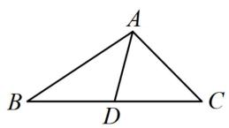
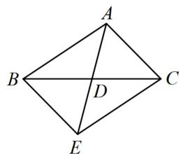
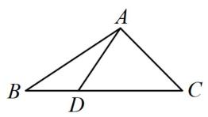
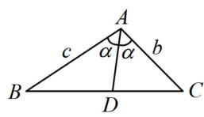

<!-- source-part:1 pages:1-8 -->

# 第2节 三角形的各种线（★★★）

## 内容提要

1. 中线问题: 如图 1, 在 $\triangle ABC$ 中, $AD$ 是边 $BC$ 上的中线, 有关计算常采用下面的几种方法, 这些方法在已知中线, 或者求中线的问题中都可以尝试.

方法1：在左右两个三角形中计算 $\cos \angle ADB$ 和 $\cos \angle ADC$ ，利用 $\angle ADB$ 与 $\angle ADC$ 互补，建立方程求解.

方法2：借助 $\overrightarrow{AD} = \frac{1}{2} (\overrightarrow{AB} +\overrightarrow{AC})$ ，并将其平方来计算目标.

方法3：将 $\triangle ABC$ 补全为如图2所示的平行四边形 $ABEC$ ，转化到 $\triangle ABE$ 中完成相关的计算.

2. 比例线问题: 如图 3, 在 $\triangle ABC$ 中, $D$ 在 $BC$ 上但不是中点, 且已知 $BD$ 与 $CD$ 的长度之比, 这类问题可采用上面的方法 1 和方法 2 求解.

3. 角平分线问题: 如图 4, 在 $\triangle ABC$ 中, $AD$ 是 $\angle BAC$ 的平分线, 有关问题常用下面两种方法求解.

方法1：用角平分线性质定理 $\frac{AB}{AC} = \frac{BD}{CD}$ 来研究 $BD$ 和 $CD$ 的比例关系，从而将问题转化为上述第2类问题。大题中，可先用面积比证明该定理， $\frac{S_{\triangle ABD}}{S_{\triangle ACD}} = \frac{\frac{1}{2} AB \cdot AD \cdot \sin \angle BAD}{\frac{1}{2} AC \cdot AD \cdot \sin \angle CAD} = \frac{\frac{1}{2} BD \cdot h}{\frac{1}{2} CD \cdot h}$ （其中 $h$ 为 $\triangle ABC$ 的边 $BC$ 上的高），所以 $\frac{AB}{AC} = \frac{BD}{CD}$ 。

方法2：如图4，设 $\angle BAC = 2\alpha$ ，由 $S_{\triangle ABD} + S_{\triangle ACD} = S_{\triangle ABC}$ 可得 $\frac{1}{2} c\cdot AD\cdot \sin \alpha +\frac{1}{2} b\cdot AD\cdot \sin \alpha = \frac{1}{2} bc\sin 2\alpha$ ，化简得 $(b + c)AD = 2bc\cos \alpha$ ，很多时候我们可以运用这一关于 $b,c,AD$ 和 $\alpha$ 的方程来解决问题.

  
图1

  
图2

  
图3

  
图4

![[高中/总复习/教辅/一数常规版2026/第5章 解三角形/模块3：几何问题篇/2三角形的各种线/类型01_中线类问题/类型01_中线类问题.md]]
![[高中/总复习/教辅/一数常规版2026/第5章 解三角形/模块3：几何问题篇/2三角形的各种线/类型02_比例线有关的问题/类型02_比例线有关的问题.md]]
![[高中/总复习/教辅/一数常规版2026/第5章 解三角形/模块3：几何问题篇/2三角形的各种线/类型03_角平分线有关的问题/类型03_角平分线有关的问题.md]]
![[高中/总复习/教辅/一数常规版2026/第5章 解三角形/模块3：几何问题篇/2三角形的各种线/强化训练/强化训练.md]]
