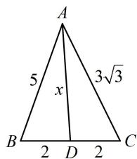

> [!faq]- 《2三角形的各种线》参考答案
>
> > [!success]- **【答案】** 详见解析
>
> > [!note]- **【分析】**
> > 本题未单列分析。
>
> > [!note]- **【解析】**
> > $\sqrt{22}$
> >
> > 解法 1: 已知三边, 可先在 $\triangle ABC$ 中算 $\cos B$ , 再到 $\triangle ABD$ 中由余弦定理算 $AD$ ,
> >
> > 由题意， $\cos B = \frac{a^2 + c^2 - b^2}{2ac} = \frac{7}{20}$ ，在 $\triangle ABD$ 中， $AD^{2} =$
> >
> > $AB^{2} + BD^{2} - 2AB\cdot BD\cdot \cos B = 22$ ，所以 $AD = \sqrt{22}$
> >
> > 解法 2: 如图, 所有线段中只有 $A D$ 未知, 可利用 $\angle A D B$ 与 $\angle A D C$ 互补, 建立方程求 $A D$ ,
> >
> > 设 $AD = x$ ，由图可知 $\angle ADC = \pi -\angle ADB$
> >
> > 所以 $\cos \angle ADC = \cos (\pi -\angle ADB) = -\cos \angle ADB$
> >
> > 故 $\frac{x^2 + 4 - 27}{2 \times x \times 2} = -\frac{x^2 + 4 - 25}{2 \times x \times 2}$ ，解得： $x = \sqrt{22}$ 。
> >
> > 
