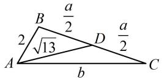
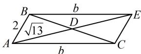

> [!faq]- 《2三角形的各种线》参考答案
>
> > [!success]- **【答案】** 详见解析
>
> > [!note]- **【分析】**
> > 本题未单列分析。
>
> > [!note]- **【解析】**
> > 解法1：因为 $b\sin C + a\sin A = b\sin B + c\sin C$
> >
> > 所以 $bc + a^2 = b^2 +c^2$ ，从而 $b^{2} + c^{2} - a^{2} = bc$
> >
> > 故 $\cos A = \frac{b^2 + c^2 - a^2}{2bc} = \frac{bc}{2bc} = \frac{1}{2}$ ，结合 $0 < A < \pi$ 得 $A = \frac{\pi}{3}$ ；
> >
> > 如图1，有 $a, b$ 两个未知数，需建立两个方程求解，首先对 $A$ 用余弦定理建立一个方程，
> >
> > 由余弦定理， $a^2 = b^2 +c^2 -2bc\cos A$
> >
> > 将 c=2 和 $A=\frac{\pi}{3}$ 代入整理得： $a^{2}=b^{2}+4-2b$ ①，
> >
> > 由 $\angle ADB$ 与 $\angle ADC$ 互补可建立第二个方程,
> >
> > 又 $\angle ADB = \pi -\angle ADC$ ，所以 $\cos \angle ADB = \cos (\pi -\angle ADC)$
> >
> > $= -\cos \angle ADC$ ，故 $\frac{\frac{a^2}{4} + 13 - 4}{2\cdot\frac{a}{2}\cdot\sqrt{13}} = -\frac{\frac{a^2}{4} + 13 - b^2}{2\cdot\frac{a}{2}\cdot\sqrt{13}}$
> >
> > 化简得： $a^2 = 2b^2 -44$ ，代入①整理得： $b^{2} + 2b - 48 = 0$
> >
> > 解得： $b = 6$ 或-8（舍去），代入式①可求得 $a = 2\sqrt{7}$
> >
> > 解法2：求 $A$ 的过程同解法1，接下来由于 $D$ 是 $BC$ 中点，故也可将 $\overrightarrow{AD}$ 用 $\overrightarrow{AB}$ 和 $\overrightarrow{AC}$ 表示，借助向量的运算来求 $b$ 因为 $D$ 是 $BC$ 中点，所以 $\overrightarrow{AD} = \frac{1}{2} (\overrightarrow{AC} +\overrightarrow{AB})$
> >
> > 从而 $\left|\overrightarrow{AD}\right|^2 = \frac{1}{4} (\left|\overrightarrow{AC}\right|^2 +\left|\overrightarrow{AB}\right|^2 +2\overrightarrow{AC}\cdot \overrightarrow{AB})$
> >
> > 故 $13 = \frac{1}{4}\left(b^{2} + 4 + 2b\cdot 2\cos \frac{\pi}{3}\right)$ ，解得： $b = 6$ 或-8（舍去），
> >
> > 已知两边及夹角了，可由余弦定理求第三边 $a$
> >
> > 所以 $a^2 = b^2 + c^2 - 2bc\cos A = 36 + 4 - 2\times 6\times 2\times \cos \frac{\pi}{3}$
> >
> > $= 28$ ，故 $a = 2\sqrt{7}$
> >
> > 解法3：求 $A$ 的过程同解法1，接下来也可将 $\triangle ABC$ 补全为如图2所示的平行四边形ABEC，先在 $\triangle ABE$ 中算 $b$ 如图2， $BE = AC = b$ ， $AE = 2AD = 2\sqrt{13}$
> >
> > $\angle ABE = \pi - A = \frac{2\pi}{3}$ ，在 $\triangle ABE$ 中，由余弦定理，
> >
> > $$
> > A E ^ {2} = A B ^ {2} + B E ^ {2} - 2 A B \cdot B E \cdot \cos \angle A B E
> > $$
> >
> > 所以 $52 = 4 + b^{2} - 2 \times 2 \times b \times \cos \frac{2\pi}{3}$ ,
> >
> > 解得： $b = 6$ 或-8（舍去），接下来求 $a$ 的过程同解法2.
> >
> >   
> > 图1
> >
> >   
> > 图2
>
> > [!tip]- **【反思】**
> > 后续多道题都有多种解法，为了篇幅简洁，我们以双余弦法（解法1）为主.
