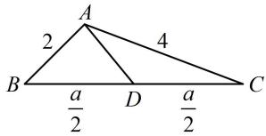

> [!faq]- 《2三角形的各种线》参考答案
>
> > [!success]- **【答案】** 详见解析
>
> > [!note]- **【分析】**
> > 本题未单列分析。
>
> > [!note]- **【解析】**
> > (1,3)
> >
> > 解法 1: 可选择 $a$ 作为变量, 利用 $\angle ADB$ 与 $\angle ADC$ 互补建立等量关系, 把中线 $AD$ 用 $a$ 表示, 再求范围,
> >
> > 如图， $\angle ADB = \pi -\angle ADC$ ，所以 $\cos \angle ADB =$
> >
> > $$
> > \cos (\pi - \angle A D C) = - \cos \angle A D C
> > $$
> >
> > 从而 $\frac{AD^2 + BD^2 - AB^2}{2AD\cdot BD} = -\frac{AD^2 + CD^2 - AC^2}{2AD\cdot CD}$
> >
> > 故 $\frac{AD^2 + \frac{a^2}{4} - 4}{2AD\cdot\frac{a}{2}} = -\frac{AD^2 + \frac{a^2}{4} - 16}{2AD\cdot\frac{a}{2}}$ ，故 $AD = \sqrt{10 - \frac{a^2}{4}}$ ①，
> >
> > 下面先由三角形两边之和大于第三边来求 $a$ 的范围，
> >
> > 因为 $\left\{\begin{aligned}a+b&>c\\ a+c&>b\\ b+c&>a\end{aligned}\right.$ ，所以 $\left\{\begin{aligned}a+4&>2\\ a+2&>4\\ 2+a&>a\end{aligned}\right.$ ，故2<a<6，
> >
> > 结合式①可得 $1 < AD < 3$
> >
> > 解法2: $\triangle ABC$ 已知两边, 可引入夹角为变量, 那么 $\overrightarrow{AB}$ 和 $\overrightarrow{AC}$ 就知道长度和夹角, 用向量求 $AD$ 很方便, 设 $\angle BAC = \theta (0 < \theta < \pi)$ , 由题意, $\overrightarrow{AD} = \frac{1}{2} (\overrightarrow{AB} + \overrightarrow{AC})$ ,
> >
> > 所以 $\overrightarrow{AD}^2 = \frac{1}{4} (\overrightarrow{AB}^2 +\overrightarrow{AC}^2 +2\overrightarrow{AB}\cdot \overrightarrow{AC})$
> >
> > $$
> > = \frac {1}{4} (2 ^ {2} + 4 ^ {2} + 2 \times 2 \times 4 \times \cos \theta) = 5 + 4 \cos \theta
> > $$
> >
> > 因为 $0 < \theta < \pi$ ，所以 $-1 < \cos \theta < 1$
> >
> > 从而 $1 < \overrightarrow{AD}^2 = 5 + 4\cos \theta < 9$ ，故 $1 < |\overrightarrow{AD}| < 3$
> >
> > 
