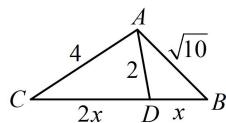

> [!faq]- 《2三角形的各种线》参考答案
>
> > [!success]- **【答案】** 6
>
> > [!note]- **【分析】**
> > 本题未单列分析。
>
> > [!note]- **【解析】**
> > 解析：如图，所有线段中，只有 $BD$ 和 $CD$ 未知，可设它们为未知数，用双余弦法建立方程求解，
> >
> > 设 $BD = x$ ，则 $CD = 2x$ ，因为 $\angle ADC = \pi -\angle ADB$
> >
> > 所以 $\cos \angle ADC = \cos (\pi -\angle ADB) = -\cos \angle ADB$
> >
> > 故 $\frac{4 + 4x^2 - 16}{2\times 2\times 2x} = -\frac{4 + x^2 - 10}{2\times 2\times x}$ ，所以 $x = 2$ ，故 $a = 3x = 6$
> >
> > 
