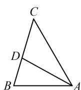

> [!faq]- 《2三角形的各种线》参考答案
>
> > [!success]- **【答案】** 2
>
> > [!note]- **【分析】**
> > 本题未单列分析。
>
> > [!note]- **【解析】**
> > 解析：如图，只要求出 $AC$ ，就能利用等面积法建立方程求 $AD$ ，已知两边一角，可用余弦定理求第三边，
> >
> > 由余弦定理， $BC^{2} = AB^{2} + AC^{2} - 2AB\cdot AC\cdot \cos \angle BAC$
> >
> > 将已知条件代入可得 $6 = 4 + AC^2 - 2 \times 2 \times AC \times \cos 60^\circ$
> >
> > 解得： $AC = 1 + \sqrt{3}$ 或 $1 - \sqrt{3}$ （舍去），
> >
> > 因为 $S_{\triangle ABD} + S_{\triangle ACD} = S_{\triangle ABC}$ ，所以 $\frac{1}{2}\times 2\times AD\times \sin 30^{\circ}+$
> >
> > $$
> > \frac {1}{2} \times (1 + \sqrt {3}) \times A D \times \sin 3 0 ^ {\circ} = \frac {1}{2} \times 2 \times (1 + \sqrt {3}) \times \sin 6 0 ^ {\circ}
> > $$
> >
> > 解得： $AD = 2$
> >
> > 
