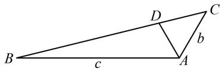
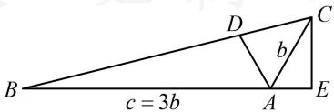

> [!faq]- 《2三角形的各种线》参考答案
>
> > [!success]- **【答案】** A
>
> > [!note]- **【分析】**
> > 本题未单列分析。
>
> > [!note]- **【解析】**
> > A
> >
> > 解法1：角平分线条件怎么翻译？别慌用等面积法，因为 $S_{\triangle ABD} = 3S_{\triangle ADC}$ 意味着 $BD = 3DC$ ，结合角平分线性质定理就可以得到 $c$ 与 $b$ 的比例关系，思路就有了，由角平分线性质定理， $\frac{b}{c} = \frac{AC}{AB} = \frac{CD}{BD} = \frac{1}{3} \Rightarrow c = 3b$ ，
> >
> > 只要有三边比值，就能由余弦定理推论求 $B$ ，故考虑再找 $a$ 与 $b$ ， $c$ 的关系，可对已知的 $\angle BAC$ 用余弦定理建立方程，由余弦定理， $a^2 = b^2 + c^2 - 2bc\cos \angle BAC = b^2 + c^2 + bc$ ，
> >
> > 结合 $c = 3b$ 可得 $a^2 = 13b^2$ ，所以 $a = \sqrt{13} b$
> >
> > 故 $\cos B = \frac{a^2 + c^2 - b^2}{2ac} = \frac{13b^2 + 9b^2 - b^2}{2\times\sqrt{13}b\times 3b} = \frac{7}{2\sqrt{13}}$
> >
> > 所以 $\sin B = \sqrt{1 - \cos^2B} = \frac{\sqrt{3}}{2\sqrt{13}}$ ，故 $\tan B = \frac{\sin B}{\cos B} = \frac{\sqrt{3}}{7}$
> >
> >   
> > 图1
> >
> > 解法2：得到 $c = 3b$ 的过程同解法1，接下来求 $\tan B$ 也可考虑构造一个以 $B$ 为其中一个内角的Rt△来简化运算，如图2，作 $CE\bot BA$ 于点 $E$ ， $\angle BAC = \frac{2\pi}{3}\Rightarrow \angle CAE = \frac{\pi}{3}$ 故 $AE = AC\cdot \cos \angle CAE = \frac{b}{2}$ ， $CE = AC\cdot \sin \angle CAE = \frac{\sqrt{3}b}{2}$ 所以 $\tan B = \frac{CE}{BE} = \frac{CE}{AB + AE} = \frac{\frac{\sqrt{3}b}{2}}{3b + \frac{b}{2}} = \frac{\sqrt{3}}{7}$
> >
> >   
> > 图2
