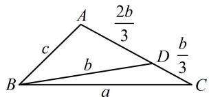

> [!faq]- 《2三角形的各种线》参考答案
>
> > [!success]- **【答案】** 详见解析
>
> > [!note]- **【分析】**
> > 本题未单列分析。
>
> > [!note]- **【解析】**
> > 解：（1）因为 $BD\sin \angle ABC = a\sin C$ ，所以 $BD \cdot b = ac$ 又 $b^{2} = ac$ ，所以 $BD \cdot b = b^{2}$ ，故 $BD = b$ ：
> >
> > （2）（如图，根据 $\angle ADB$ 与 $\angle CDB$ 互补，利用双余弦法可建立一个边的方程，结合题干的 $b^{2} = ac$ ，能找到三边的比例关系，由余弦定理推论求 $\cos \angle ABC$ ）因为 $AD = 2DC$ ，所以 $AD = \frac{2b}{3}$ ， $CD = \frac{b}{3}$
> >
> > 由（1）知 $BD = b$ ，在 $\triangle ABD$ 中，由余弦定理推论，
> >
> > $$
> > \cos \angle A D B = \frac {A D ^ {2} + B D ^ {2} - A B ^ {2}}{2 A D \cdot B D} = \frac {\frac {4 b ^ {2}}{9} + b ^ {2} - c ^ {2}}{2 \cdot \frac {2 b}{3} \cdot b} = \frac {1 3 b ^ {2} - 9 c ^ {2}}{1 2 b ^ {2}},
> > $$
> >
> > 同理，在 $\triangle CBD$ 中， $\cos \angle CDB = \frac{CD^2 + BD^2 - BC^2}{2CD \cdot BD}$
> >
> > $= \frac{\frac{b^2}{9} + b^2 - a^2}{2\cdot\frac{b}{3}\cdot b} = \frac{10b^2 - 9a^2}{6b^2}$ ，因为 $\angle ADB = \pi -\angle CDB$
> >
> > 所以 $\cos \angle ADB = \cos (\pi -\angle CDB) = -\cos \angle CDB$
> >
> > 故 $\frac{13b^2 - 9c^2}{12b^2} = -\frac{10b^2 - 9a^2}{6b^2}$ ，化简得： $6a^{2} - 11b^{2} + 3c^{2} = 0$
> >
> > 将 $b^{2} = ac$ 代入上式整理得： $6a^{2} - 11ac + 3c^{2} = 0$
> >
> > 故 $(3a - c)(2a - 3c) = 0$ ，所以 $a = \frac{c}{3}$ 或 $a = \frac{3}{2} c$
> >
> > (需检验上述两种情况是否都满足题意, 可用较小的两边之和大于最长边来检验)
> >
> > 若 $a = \frac{c}{3}$ ，则 $b = \sqrt{ac} = \frac{\sqrt{3}}{3} c$ ，此时 $a + b = \frac{1 + \sqrt{3}}{3} c < c$
> >
> > 无法构成三角形，舍去，所以 $a = \frac{3}{2} c$ ， $b = \sqrt{ac} = \frac{\sqrt{6}}{2} c$
> >
> > $$
> > \cos \angle A B C = \frac {a ^ {2} + c ^ {2} - b ^ {2}}{2 a c} = \frac {\frac {9}{4} c ^ {2} + c ^ {2} - \frac {3}{2} c ^ {2}}{2 \cdot \frac {3}{2} c \cdot c} = \frac {7}{1 2}
> > $$
> >
> > 
>
> > [!tip]- **【反思】**
> > 上面第（2）问由 $\cos \angle ADB = -\cos \angle CDB$ 得到边的关系的过程，也可改为分别在 $\triangle ABC$ 和 $\triangle CBD$ 中求 $\cos C$ ，从而建立等量关系，计算量会稍小一些，不妨试试.
