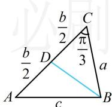

> [!faq]- 《2三角形的各种线》参考答案
>
> > [!success]- **【答案】** 详见解析
>
> > [!note]- **【分析】**
> > 本题未单列分析。
>
> > [!note]- **【解析】**
> > 解：（1）解法1：选择条件①，则 $(a - b)\sin (A + C) =$
> >
> > $(a - c)(\sin A + \sin C)$ (i)，（注意到左边的 $\sin (A + C)$ 可化为 $\sin B$ ，所以上式等号两侧既有齐次的边，也有齐次的内角正弦值，所以既能边化角，又能角化边，选谁呢？经尝试，若边化角，则下一步按角化简不易，故考虑角化边分析）
> >
> > 在 $\triangle ABC$ 中， $\sin (A + C) = \sin (\pi - B) = \sin B$
> >
> > 代入(i)得 $(a-b)\sin B=(a-c)(\sin A+\sin C)$ ，
> >
> > 由正弦定理， $(a-b)b=(a-c)(a+c)$ ，
> >
> > 化简得： $a^2 + b^2 - c^2 = ab$
> >
> > (看到 $a^{2}+b^{2}-c^{2}$ ，想到用余弦定理推论求 $\cos C$ )
> >
> > 由余弦定理推论， $\cos C = \frac{a^2 + b^2 - c^2}{2ab} = \frac{ab}{2ab} = \frac{1}{2}$
> >
> > 结合 $C \in (0, \pi)$ 可得 $C = \frac{\pi}{3}$ .
> >
> > 解法2：选择条件②，则 $\sin \left(\frac{\pi}{6} - C\right)\cos \left(C + \frac{\pi}{3}\right) = \frac{1}{4}$ (ii)，
> >
> > （上式怎么处理？要展开吗？展开再化简可行，但比较麻烦，注意到涉及的两个角相加为 $\frac{\pi}{2}$ ，故可用诱导公式快速化简） $\sin \left(\frac{\pi}{6} - C\right) \cos \left(C + \frac{\pi}{3}\right) =$
> >
> > $$
> > \sin \left[ \frac {\pi}{2} - \left(C + \frac {\pi}{3}\right) \right] \cos \left(C + \frac {\pi}{3}\right) = \cos^ {2} \left(C + \frac {\pi}{3}\right)
> > $$
> >
> > 代入(ii)得 $\cos^2\left(C + \frac{\pi}{3}\right) = \frac{1}{4}$ ，故 $\cos \left(C + \frac{\pi}{3}\right) = \pm \frac{1}{2}$ (iii)，
> >
> > 又 $0 < C < \pi$ ，所以 $\frac{\pi}{3} < C + \frac{\pi}{3} < \frac{4\pi}{3}$
> >
> > 故 $-1 \leq \cos \left( C + \frac{\pi}{3} \right) < \frac{1}{2}$ ，结合(iii)得 $\cos \left( C + \frac{\pi}{3} \right) = -\frac{1}{2}$ ，
> >
> > 此时 $C + \frac{\pi}{3} = \frac{2\pi}{3}$ ，所以 $C = \frac{\pi}{3}$
> >
> > （2）（条件给出了 $\triangle ABC$ 的面积，已知 $C$ ，我们先用 $C$ 表示面积）由（1）得 $S_{\triangle ABC} = \frac{1}{2} ab\sin C = \frac{1}{2} ab\sin \frac{\pi}{3} = \frac{\sqrt{3}}{4} ab$ 又由题意， $S_{\triangle ABC} = 5\sqrt{3}$ ，所以 $\frac{\sqrt{3}}{4} ab = 5\sqrt{3}$ ，故 $ab = 20$
> >
> > （有了 $a, b$ 的关系，要求 $BD$ 的范围，考虑把 $BD$ 用 $a, b$ 表示，如图，观察发现在 $\triangle BCD$ 中用余弦定理即可）在 $\triangle BCD$ 中，由余弦定理，
> >
> > $$
> > B D ^ {2} = B C ^ {2} + C D ^ {2} - 2 B C \cdot C D \cdot \cos C = a ^ {2} + \frac {1}{4} b ^ {2} - \frac {1}{2} a b \geq 2 a \cdot \frac {1}{2} b - \frac {1}{2} a b = \frac {1}{2} a b = 1 0,
> > $$
> >
> > 所以 $BD \geq \sqrt{10}$ ，当且仅当 $a = \frac{1}{2} b$ 时取等号，
> >
> > 结合 ab=20 可得 $a=\sqrt{10}$ ， $b=2\sqrt{10}$ ，
> >
> > 所以 $BD$ 的最小值为 $\sqrt{10}$
> >
> > 
