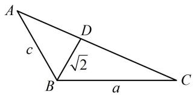

> [!faq]- 《2三角形的各种线》参考答案
>
> > [!success]- **【答案】** 详见解析
>
> > [!note]- **【分析】**
> > 本题未单列分析。
>
> > [!note]- **【解析】**
> > 解: (1) 因为 $\sqrt{3} a - 2 b \sin A = 0$ ,
> >
> > 所以 $\sqrt{3}\sin A-2\sin B\sin A=0$ ①,
> >
> > 又 $0 < A < \pi$ ，所以 $\sin A > 0$ ，故在式①中约去 $\sin A$ 可得
> >
> > $\sqrt{3}-2\sin B=0$ ，所以 $\sin B=\frac{\sqrt{3}}{2}$ ，
> >
> > 结合 $0 < B < \pi$ 可得 $B = \frac{\pi}{3}$ 或 $\frac{2\pi}{3}$ .
> >
> > （2）由（1）知若 $B$ 为钝角，则 $B = \frac{2\pi}{3}$
> >
> > 所以 $S_{\triangle ABC} = \frac{1}{2} ac\sin B = \frac{\sqrt{3}}{4} ac$
> >
> > （要求上式的最小值，需寻找 $a, c$ 的关系，这是已知顶角的角平分线问题，可用等面积法建立方程）因为 $BD$ 是角 $B$ 的平分线，所以 $\angle ABD = \angle CBD = \frac{\pi}{3}$ ，
> >
> > 由 $S_{\triangle ABD} + S_{\triangle CBD} = S_{\triangle ABC}$ 得 $\frac{1}{2} c\cdot \sqrt{2}\cdot \sin \frac{\pi}{3} +\frac{1}{2} a\cdot \sqrt{2}\cdot \sin \frac{\pi}{3}$
> >
> > $= \frac{\sqrt{3}}{4} ac$ ，整理得： $\sqrt{2} (a + c) = ac$
> >
> > (为了求 $ac$ 的最小值, 可将上式中的 $a + c$ 变成 $ac$ )
> >
> > 所以 $ac = \sqrt{2} (a + c) \geq \sqrt{2} \times 2\sqrt{ac}$ ，故 $ac \geq 8$ ，
> >
> > 当且仅当 $a = c = 2\sqrt{2}$ 时取等号，
> >
> > 
> >
> > 所以 $S_{\triangle ABC} = \frac{\sqrt{3}}{4} ac \geq \frac{\sqrt{3}}{4} \times 8 = 2\sqrt{3}$ ，故 $(S_{\triangle ABC})_{\min} = 2\sqrt{3}$ 。
> >
> > 一数·必刷100讲
