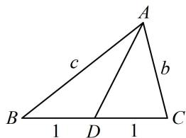

<!-- question-source:start -->
【变式2】在 $\triangle ABC$ 中，角 $A, B, C$ 的对边分别为 $a, b, c$ ，且 $a = 2$ ， $\frac{a^2 + c^2 - b^2}{4a\cos A} = \frac{\tan A}{\tan B}$ .

（1）若 $\triangle ABC$ 的面积 $S$ 满足 $S = 2\cos A$ ，求角 $A$

(2) 若边 $BC$ 上的中线为 $AD$ , 求 $AD$ 长的最小值.

（1）（看到 $a^2 + c^2 - b^2$ ，想到余弦定理）由余弦定理， $b^2 = a^2 + c^2 - 2ac\cos B$ ，故 $a^2 + c^2 - b^2 = 2ac\cos B$ ，代入 $\frac{a^2 + c^2 - b^2}{4a\cos A} = \frac{\tan A}{\tan B}$ 可得 $\frac{2ac\cos B}{4a\cos A} = \frac{\tan A}{\tan B}$ ，所以 $\frac{c\cos B}{2\cos A} = \frac{\sin A\cos B}{\cos A\sin B}$ ①，（可约去 $\frac{\cos B}{\cos A}$ ，再角化边）由题意， $A \neq \frac{\pi}{2}$ ， $B \neq \frac{\pi}{2}$ ，所以 $\cos A \neq 0$ ， $\cos B \neq 0$ ，故在式①中约掉 $\frac{\cos B}{\cos A}$ 可得 $\frac{c}{2} = \frac{\sin A}{\sin B}$ ，所以 $\frac{c}{2} = \frac{a}{b}$ ，故 $bc = 2a = 4$ ，所以 $S = \frac{1}{2} bc\sin A = 2\sin A$ ，

由题意， $S = 2\cos A$ ，所以 $2\sin A = 2\cos A$ ，故 $\tan A = 1$ ，结合 $0 < A < \pi$ 可得 $A = \frac{\pi}{4}$

(2) (已知了 $bc = 4$ , 故先把 $AD$ 用 $b$ 和 $c$ 表示, 可由 $\angle ADB$ 与 $\angle ADC$ 互补建立方程求 $AD$ )

由题意， $BD = CD = 1$ ，如图，在 $\triangle ABD$ 中， $\cos \angle ADB = \frac{AD^2 + BD^2 - AB^2}{2AD\cdot BD} = \frac{AD^2 + 1 - c^2}{2AD}$

在 $\triangle ADC$ 中， $\cos \angle ADC = \frac{AD^2 + CD^2 - AC^2}{2AD \cdot CD} = \frac{AD^2 + 1 - b^2}{2AD}$ ，

因为 $\angle ADB = \pi -\angle ADC$ ，所以 $\cos \angle ADB = \cos (\pi -\angle ADC) = -\cos \angle ADC$

从而 $\frac{AD^2 + 1 - c^2}{2AD} = -\frac{AD^2 + 1 - b^2}{2AD}$ ，故 $AD^2 = \frac{b^2 + c^2}{2} - 1$ ，由
（1）知 $bc = 4$ ，

所以 $AD^2 = \frac{b^2 + c^2}{2} - 1 \geq bc - 1 = 3$ ，故 $AD \geq \sqrt{3}$ ，

当且仅当 $b = c = 2$ 时取等号，所以 $AD_{\mathrm{min}} = \sqrt{3}$
<!-- question-source:end -->

![[高中/总复习/教辅/一数常规版2026/第5章 解三角形/模块3：几何问题篇/2三角形的各种线/类型01_中线类问题/例题/answers/Q00050298A1.md]]
