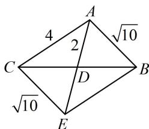
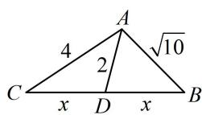

> [!faq]- 《2三角形的各种线》例题解析
>
> > [!success]- **【答案】** 6
>
> > [!note]- **【分析】**
> > 本题未单列分析。
>
> > [!note]- **【解析】**
> > 解法1：如图1，观察发现只有 $CD$ 和 $BD$ 未知，可利用 $\angle ADC$ 和 $\angle ADB$ 互补建立方程求解它们，设 $BD = CD = x$ ，由图可知 $\angle ADC = \pi -\angle ADB$ ，所以 $\cos \angle ADC = \cos (\pi -\angle ADB) = -\cos \angle ADB$ ，
> >
> > 从而 $\frac{4 + x^2 - 16}{2\times 2x} = -\frac{4 + x^2 - 10}{2\times 2x}$ ，故 $x = 3$ ，所以 $a = 2x = 6$
> >
> > 解法2：已知 $b$ 和 $c$ ，只要求出 $\cos A$ ，就能用余弦定理求 $a$ ，可将 $\overrightarrow{AD}$ 用 $\overrightarrow{AB}$ 和 $\overrightarrow{AC}$ 表示，平方求出 $\cos A$ 因为 $D$ 是 $BC$ 的中点，所以 $\overrightarrow{AD} = \frac{1}{2} (\overrightarrow{AB} +\overrightarrow{AC})$ ，故 $\left|\overrightarrow{AD}\right|^2 = \frac{1}{4} (\left|\overrightarrow{AB}\right|^2 +\left|\overrightarrow{AC}\right|^2 +2\overrightarrow{AB}\cdot \overrightarrow{AC})$
> >
> > 将已知条件代入可得 $4 = \frac{1}{4} (10 + 16 + 2 \times \sqrt{10} \times 4 \times \cos A)$ ，故 $\cos A = -\frac{\sqrt{10}}{8}$ ，
> >
> > 由余弦定理， $a^2 = b^2 + c^2 - 2bc\cos A = 4^2 + (\sqrt{10})^2 - 2 \times 4 \times \sqrt{10} \times \left(-\frac{\sqrt{10}}{8}\right) = 36$ ，所以 $a = 6$
> >
> > 解法3：借助平行四边形对角线互相平分的性质，可将 $\triangle ABC$ 补全为如图2所示的平行四边形 $ABEC$
> >
> > 由图可知， $CE = AB = \sqrt{10}$ ， $AE = 2AD = 4$
> >
> > 在 $\triangle ACE$ 中， $\cos \angle ACE = \frac{AC^2 + CE^2 - AE^2}{2AC \cdot CE} = \frac{\sqrt{10}}{8}$ ，
> >
> > $$
> > \cos A = \cos (\pi - \angle A C E) = - \cos \angle A C E = - \frac {\sqrt {1 0}}{8}
> > $$
> >
> > $$
> > \triangle A B C
> > $$
> >
> > $$
> > a ^ {2} = b ^ {2} + c ^ {2} - 2 b c \cos A
> > $$
> >
> > $= 4^{2} + (\sqrt{10})^{2} - 2 \times 4 \times \sqrt{10} \times \left(-\frac{\sqrt{10}}{8}\right) = 36$ ，所以 $a = 6$
> >
> > 
> >
> >   
> > 图1  
> > 图2
>
> > [!tip]- **【反思】**
> > 中线有关的计算常用上面的三种方法，后续变式都可一题多解，为了篇幅简洁，后两题都用解法1作答，解法1可称为“双余弦法”.
