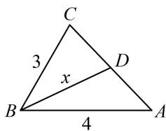

> [!faq]- 《2三角形的各种线》例题解析
>
> > [!success]- **【答案】** 详见解析
>
> > [!note]- **【分析】**
> > 本题未单列分析。
>
> > [!note]- **【解析】**
> > （2）若 D 为边 AC 的中点，且 a=3，c=4，求中线 BD 的长.
> >
> > 解：
> > （1）（所给等式可边化角，也可角化边，但若边化角，则下一步按角化简不易，故角化边）
> >
> > 因为 $\frac{\sin B + \sin C}{\sin A - \sin C} = \frac{a}{b - c}$ ，所以 $\frac{b + c}{a - c} = \frac{a}{b - c}$ ，从而 $(b + c)(b - c) = a(a - c)$ ，故 $a^2 + c^2 - b^2 = ac$ ，
> >
> > 所以 $\cos B = \frac{a^2 + c^2 - b^2}{2ac} = \frac{ac}{2ac} = \frac{1}{2}$ ，结合 $0 < B < \pi$ 可得 $B = \frac{\pi}{3}$ .
> >
> > (2) (如图, $\triangle ABC$ 已知两边及夹角, 可先由余弦定理求第三边)
> >
> > 由余弦定理， $b^{2} = a^{2} + c^{2} - 2ac\cos B = 9 + 16 - 2\times 3\times 4\times \cos \frac{\pi}{3} = 13$ ，所以 $b = \sqrt{13}$ ，故 $AD = CD = \frac{\sqrt{13}}{2}$
> >
> > (只有 BD 未知了, 可用 “双余弦法” 求 BD) 设 $BD = x$ , 由图可知, $\angle BDC = \pi - \angle BDA$ ,
> >
> > 所以 $\cos \angle BDC = \cos (\pi -\angle BDA) = -\cos \angle BDA$ ，故 $\frac{x^2 + \frac{13}{4} - 9}{2x\cdot\frac{\sqrt{13}}{2}} = -\frac{x^2 + \frac{13}{4} - 16}{2x\cdot\frac{\sqrt{13}}{2}}$
> >
> > 解得： $x = \frac{\sqrt{37}}{2}$ ，所以 $BD = \frac{\sqrt{37}}{2}$
> >
> > 
