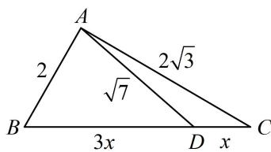

> [!faq]- 《2三角形的各种线》例题解析
>
> > [!success]- **【答案】** 4
>
> > [!note]- **【分析】**
> > 本题未单列分析。
>
> > [!note]- **【解析】**
> > 解法 2: 给出了 $B D$ 和 $C D$ 的比值关系, 就能把 $\overrightarrow {A D}$ 用 $\overrightarrow {A B}$ 和 $\overrightarrow {A C}$ 表示,
> >
> > 因为 $BD = 3CD$ ，所以 $\overrightarrow{AD} = \overrightarrow{AB} +\overrightarrow{BD} = \overrightarrow{AB} +\frac{3}{4}\overrightarrow{BC} = \overrightarrow{AB} +\frac{3}{4} (\overrightarrow{AC} -\overrightarrow{AB}) = \frac{1}{4}\overrightarrow{AB} +\frac{3}{4}\overrightarrow{AC},$
> >
> > 由于 $\left|\overrightarrow{AD}\right|$ ， $\left|\overrightarrow{AB}\right|$ ， $\left|\overrightarrow{AC}\right|$ 均已知，故将上式平方可求得 $\overrightarrow{AB}$ 与 $\overrightarrow{AC}$ 的夹角A，
> >
> > 所以 $\left|\overrightarrow{AD}\right|^2 = \frac{1}{16}\left|\overrightarrow{AB}\right|^2 +\frac{9}{16}\left|\overrightarrow{AC}\right|^2 +\frac{3}{8}\overrightarrow{AB}\cdot \overrightarrow{AC},$
> >
> > 故 $7 = \frac{1}{16} \times 4 + \frac{9}{16} \times 12 + \frac{3}{8} \times 2 \times 2\sqrt{3} \times \cos A$ ，解得： $\cos A = 0$ ，
> >
> > 所以 $A=90^{\circ}$ ，故 $a=\sqrt{b^{2}+c^{2}}=4$ 。
> >
> > 
>
> > [!tip]- **【反思】**
> > 当 $D$ 不再是中点，而是三等分点、四等分点这些情况时，双余弦、向量的方法仍然适用.
