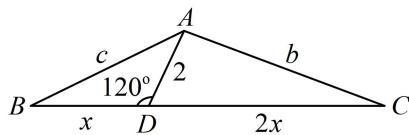

> [!faq]- 《2三角形的各种线》例题解析
>
> > [!success]- **【答案】** $\sqrt{3} - 1$
>
> > [!note]- **【分析】**
> > 本题未单列分析。
>
> > [!note]- **【解析】**
> > 解析：如图，若设 $BD = x$ ， $CD = 2x$ ，则可在 $\triangle ABD$ 和 $\triangle ACD$ 中用余弦定理分别建立 $c$ 和 $b$ 与 $x$ 的关系，从而将 $\frac{b}{c}$ 用 $x$ 表示，化为单变量函数求最值，
> >
> > 在 $\triangle ABD$ 中，由余弦定理， $c^2 = x^2 + 2^2 - 2x \cdot 2 \times \cos 120^\circ = x^2 + 2x + 4$
> >
> > 在 $\triangle ACD$ 中， $\angle ADC = 180^{\circ} - \angle ADB = 60^{\circ}$ ，由余弦定理， $b^{2} = (2x)^{2} + 2^{2} - 2 \times 2x \times 2 \times \cos 60^{\circ} = 4x^{2} - 4x + 4$ ，我们发现 $\frac{b^{2}}{c^{2}}$ 是一个“ $\frac{\text{二次函数}}{\text{二次函数}}$ ”的结构，可通过拆项化为“ $\frac{\text{一次函数}}{\text{二次函数}}$ ”的结构，
> >
> > 所以 $\frac{b^2}{c^2} = \frac{4x^2 - 4x + 4}{x^2 + 2x + 4} = \frac{4(x^2 + 2x + 4) - 12x - 12}{x^2 + 2x + 4} = 4 - \frac{12(x + 1)}{x^2 + 2x + 4} = 4 - \frac{12(x + 1)}{(x + 1)^2 + 3}$
> >
> > $$
> > = 4 - \frac {1 2}{(x + 1) + \frac {3}{x + 1}} \geq 4 - \frac {1 2}{2 \sqrt {(x + 1) \cdot \frac {3}{x + 1}}} = 4 - 2 \sqrt {3},
> > $$
> >
> > 当且仅当 $x + 1 = \frac{3}{x + 1}$ 时取等号，此时 $x = \sqrt{3} - 1$
> >
> > 所以当 $\frac{b}{c}$ 取得最小值时， $BD = \sqrt{3} -1$
> >
> > 
>
> > [!tip]- **【反思】**
> > 比例线问题常用双余弦、向量两种方法求解，但具体选哪种，还需看实际情况。例如本题若将 $\overrightarrow{AD}$ 用 $\overrightarrow{AB}$ 和 $\overrightarrow{AC}$ 表示，则 $\angle ADB = 120^{\circ}$ 这条件就不方便使用了，故本题应选择双余弦的方法。
