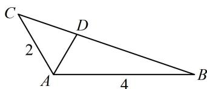

> [!faq]- 《2三角形的各种线》例题解析
>
> > [!success]- **【答案】** $\frac{4}{3}$
>
> > [!note]- **【分析】**
> > 本题未单列分析。
>
> > [!note]- **【解析】**
> > 解析：要求 $AD$ ，可用小三角形面积之和等于大三角形面积来建立关于 $AD$ 的方程，
> >
> > 因为 $\angle BAC = 120^{\circ}$ ， $AD$ 是 $\angle BAC$ 的平分线，所以 $\angle CAD = \angle BAD = 60^{\circ}$
> >
> > 又 $S_{\triangle ACD} + S_{\triangle ABD} = S_{\triangle ABC}$ ，所以 $\frac{1}{2}\times 2\times AD\times \sin 60^{\circ} + \frac{1}{2}\times 4\times AD\times \sin 60^{\circ}$
> >
> > $= \frac{1}{2}\times 2\times 4\times \sin 120^{\circ}$ ，解得： $AD = \frac{4}{3}.$
> >
> > 
>
> > [!tip]- **【反思】**
> > 利用小三角形面积之和等于大三角形面积建立方程的方法可称为“等面积法”，常解决已知或求顶角的平分线的相关问题.
