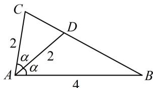

> [!faq]- 《2三角形的各种线》例题解析
>
> > [!success]- **【答案】** $\frac{1}{8}$
>
> > [!note]- **【分析】**
> > 本题未单列分析。
>
> > [!note]- **【解析】**
> > 解析：如图，AB，AC，AD已知，AD为角平分线，可用“等面积法”建立 $\alpha$ 的方程，两倍即为 $\angle BAC$ ，由题意，可设 $\angle CAD = \angle BAD = \alpha$ ，因为 $S_{\triangle ACD} + S_{\triangle ABD} = S_{\triangle ABC}$ ，
> >
> > 所以 $\frac{1}{2} \times 2 \times 2 \times \sin \alpha + \frac{1}{2} \times 2 \times 4 \times \sin \alpha = \frac{1}{2} \times 2 \times 4 \times \sin 2\alpha$
> >
> > 整理得： $3\sin\alpha=2\sin2\alpha$ ，所以 $3\sin\alpha=4\sin\alpha\cos\alpha$ ①，
> >
> > 显然 $\alpha$ 为锐角，从而 $\sin \alpha > 0$ ，故在式①中约掉 $\sin \alpha$ 可得 $\cos \alpha = \frac{3}{4}$
> >
> > 所以 $\cos \angle BAC = \cos 2\alpha = 2\cos^2\alpha -1 = \frac{1}{8}.$
> >
> > 
