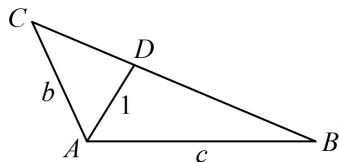

> [!faq]- 《2三角形的各种线》例题解析
>
> > [!success]- **【答案】** $2 \sqrt {3}$
>
> > [!note]- **【分析】**
> > 本题未单列分析。
>
> > [!note]- **【解析】**
> > 解析：已知 $A$ ，要求 $a$ 的最小值，可先用余弦定理把 $a$ 用 $b$ 和 $c$ 表示，
> >
> > 由余弦定理， $a^2 = b^2 +c^2 -2bc\cos A = b^2 +c^2 +bc$ ①
> >
> > 表示的结果有 $b$ 和 $c$ 两个变量, 要求最值需先找 $b, c$ 的关系, 可用等面积法建立方程,
> >
> > 如图，因为 $A = \frac{2\pi}{3}$ ，且 $AD$ 是角 $A$ 的平分线，所以 $\angle CAD = \angle BAD = \frac{\pi}{3}$
> >
> > 由图可知， $S_{\triangle ACD} + S_{\triangle ABD} = S_{\triangle ABC}$ ，所以 $\frac{1}{2} b\sin \frac{\pi}{3} +\frac{1}{2} c\sin \frac{\pi}{3} = \frac{1}{2} bc\sin \frac{2\pi}{3}$ ，整理得： $b + c = bc$ ②，
> >
> > 由式②想到将式①配方，调整为 $b + c$ 和 $bc$ 的形式，由式①可得 $a^2 = b^2 + c^2 + bc = (b + c)^2 - bc$
> >
> > 将式②代入可得 $a^2 = b^2c^2 -bc$ ③，下面先求 $bc$ 的范围，可由式②来分析，
> >
> > 由②可得 $bc = b + c \geq 2\sqrt{bc}$ ，所以 $bc \geq 4$ ，
> >
> > 当且仅当 $b = c = 2$ 时取等号，由式③知 $a^2 = \left(bc - \frac{1}{2}\right)^2 -\frac{1}{4},$
> >
> > 
> >
> > 所以当 $bc = 4$ 时， $a^2$ 取得最小值12，故 $a$ 的最小值为 $2\sqrt{3}$
