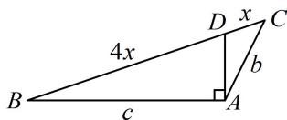

> [!faq]- 《2三角形的各种线》例题解析
>
> > [!success]- **【答案】** 详见解析
>
> > [!note]- **【分析】**
> > 本题未单列分析。
>
> > [!note]- **【解析】**
> > 解法 1: (如图, 只要找到 $a$ , $b$ , $c$ 的比例关系, 就能用余弦定理推论求出 $\cos C$ , 故考虑建立两个关于 $a$ , $b$ , $c$ 的方程, 怎么建呢? 以一方面, 已知 $A$ , 可用余弦定理建立一个方程)
> >
> > 由余弦定理， $a^2 = b^2 +c^2 -2bc\cos A = b^2 +c^2 +bc$ ①
> >
> > (观察发现由 BD=4DC 可求得 $\frac{S_{\triangle ABD}}{S_{\triangle ACD}}$ ，而这一面积比也能用 b 和 c 表示，故由此可建立第二个方程)
> >
> > 如图，因为 $A = \frac{2\pi}{3}$ ， $DA\bot BA$ ，所以 $\angle BAD = \frac{\pi}{2}$ ， $\angle CAD = \frac{\pi}{6}$
> >
> > 因为 $\frac{S_{\triangle ABD}}{S_{\triangle ACD}} = \frac{\frac{1}{2}c\cdot AD}{\frac{1}{2}b\cdot AD\cdot \sin\frac{\pi}{6}} = \frac{\frac{1}{2}BD\cdot h}{\frac{1}{2}DC\cdot h}$ （其中 $h$ 为 $\triangle ABC$ 的 $BC$ 边上的高），所以 $\frac{2c}{b} = \frac{BD}{DC} = 4$ ，故 $c = 2b$
> >
> > 代入式①可得 $a^2 = 7b^2$ ，所以 $a = \sqrt{7} b$ ，故 $\cos C = \frac{a^2 + b^2 - c^2}{2ab} = \frac{7b^2 + b^2 - 4b^2}{2\sqrt{7}b^2} = \frac{2\sqrt{7}}{7}$
> >
> > 解法2: (按解法1得到式①后, 也可抓住 $\sin \angle ADB = \sin \angle ADC$ 来找 $b$ 和 $c$ 的关系, 下面先在 $\triangle ACD$ 中计算 $\sin \angle ADC$ ) 设 $DC = x$ , 则 $BD = 4x$ , 在 $\triangle ACD$ 中, 由正弦定理, $\frac{DC}{\sin \angle CAD} = \frac{AC}{\sin \angle ADC}$ ②,
> >
> > 因为 $A = \frac{2\pi}{3}$ ， $DA\bot BA$ ，所以 $\angle BAD = \frac{\pi}{2}$ ， $\angle CAD = \frac{\pi}{6}$
> >
> > 代入式②可得 $\sin \angle ADC = \frac{AC \cdot \sin \angle CAD}{DC} = \frac{b\sin\frac{\pi}{6}}{x} = \frac{b}{2x}$ ，（接下来在 $\triangle ABD$ 中计算 $\sin \angle ADB$ ）
> >
> > 在 $\triangle ABD$ 中， $\sin \angle ADB = \frac{AB}{BD} = \frac{c}{4x}$ ，
> >
> > 因为 $\angle ADB = \pi -\angle ADC$ ，所以 $\sin \angle ADB = \sin (\pi -\angle ADC) = \sin \angle ADC$
> >
> > 
> >
> > 从而 $\frac{b}{2x} = \frac{c}{4x}$ ，故 $c = 2b$ ，接下来同解法1.
>
> > [!tip]- **【反思】**
> > AD不再是角平分线，但解法1的思路源于角平分线性质定理的推导过程，利用面积比得到边长比；解法2则抓住 $\angle ADB$ 和 $\angle ADC$ 互补，构造方程，这也是本节题型常用的建立等量关系的方法.
