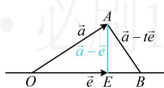

> [!faq]- 《第1节 向量的基本运算》参考答案
>
> > [!success]- **【答案】** B
>
> > [!note]- **【分析】**
> > 本题未单列分析。
>
> > [!note]- **【解析】**
> > 已知向量 $\vec{a} \neq \vec{e}$ ， $|\vec{e}| = 1$ ，对任意实数 $t$ ，恒有 $|\vec{a} - t\vec{e}| \geq |\vec{a} - \vec{e}|$ ，则（）
> > A. $\vec{a} \perp \vec{e}$ B. $\vec{e} \perp (\vec{a} - \vec{e})$ C. $\vec{a} \perp (\vec{a} - \vec{e})$ D. $(\vec{a} + \vec{e}) \perp (\vec{a} - \vec{e})$
> >
> > 解法1：已知条件涉及向量模的不等式，可考虑将其平方去掉模，转化为数量积来处理，因为 $|\vec{a} - t\vec{e}| \geq |\vec{a} - \vec{e}|$ ，所以 $|\vec{a} - t\vec{e}|^2 \geq |\vec{a} - \vec{e}|^2$ 从而 $\vec{a}^2 - 2t\vec{a} \cdot \vec{e} + t^2\vec{e}^2 \geq \vec{a}^2 - 2\vec{a} \cdot \vec{e} + \vec{e}^2$
> >
> > 故 $-2t\vec{a}\cdot \vec{e} +t^{2}\vec{e}^{2}\geq -2\vec{a}\cdot \vec{e} +\vec{e}^{2},$
> >
> > 结合 $|\vec{e}| = 1$ 可得 $-2t\vec{a}\cdot \vec{e} +t^2\geq -2\vec{a}\cdot \vec{e} +1$
> >
> > 所以 $t^2 -(2\vec{a}\cdot \vec{e})t + 2\vec{a}\cdot \vec{e} -1\geq 0$ ①，
> >
> > 怎样能使不等式①对任意的 $t \in \mathbb{R}$ 都成立？将它看成关于 $t$ 的一元二次不等式，开口向上，只需 $\Delta \leq 0$
> >
> > 所以 $\Delta = (-2\vec{a}\cdot \vec{e})^2 -4(2\vec{a}\cdot \vec{e} -1) = 4(\vec{a}\cdot \vec{e} -1)^2\leq 0$
> >
> > 故只能 $\vec{a} \cdot \vec{e} - 1 = 0$ ，即 $\vec{a} \cdot \vec{e} = 1$
> >
> > 条件翻译完了，下面我们用它来判断选项，选项都涉及向量垂直，于是计算它们的数量积，看是否为0，
> >
> > A项，因为 $\vec{a}\cdot \vec{e} = 1\neq 0$ ，所以 $\vec{a}$ 与 $\vec{e}$ 不垂直，故A项错误；
> >
> > B项，因为 $\vec{e}\cdot (\vec{a} -\vec{e}) = \vec{e}\cdot \vec{a} -\vec{e}^{2} = 1 - 1^{2} = 0$
> >
> > 所以 $\vec{e} \perp (\vec{a} - \vec{e})$ ，故B项正确；
> >
> > 此为单选题，到此已可结束，我们把余下选项也做个分析，
> >
> > C项， $\vec{a}\cdot (\vec{a} -\vec{e}) = \vec{a}^2 -\vec{a}\cdot \vec{e} = \vec{a}^2 -1$ ，没给 $|\vec{a} |$ ，所以 $\vec{a}^2 -1$ 不一定为0，从而 $\vec{a}$ 与 $\vec{a} -\vec{e}$ 不一定垂直，故C项错误；  
> > D项， $(\vec{a} +\vec{e})\cdot (\vec{a} -\vec{e}) = \vec{a}^{2} - \vec{e}^{2} = \vec{a}^{2} - 1$
> >
> > 接下来的分析同 C 项.
> >
> > 解法2：不等式 $\left|\vec{a} - t\vec{e}\right| \geq \left|\vec{a} - \vec{e}\right|$ 左右都涉及向量减法的模，且结构相近，有明显的几何特征，故也可考虑画图分析，
> >
> > 如图，设 $\overrightarrow{OA} = \vec{a}$ ， $\overrightarrow{OE} = \vec{e}$ ， $\overrightarrow{OB} = t\vec{e}$
> >
> > 则 $\vec{a} - t\vec{e} = \overrightarrow{OA} -\overrightarrow{OB} = \overrightarrow{BA}$ ， $\vec{a} -\vec{e} = \overrightarrow{OA} -\overrightarrow{OE} = \overrightarrow{EA}$
> >
> > 当 $t$ 在 $\mathbf{R}$ 上变化时，点 $B$ 在直线 $OE$ 上运动，
> >
> > 由题意， $|\vec{a} - t\vec{e}| \geq |\vec{a} - \vec{e}|$ 对任意的 $t \in \mathbf{R}$ 恒成立，
> >
> > 所以当 $B$ 在直线 $OE$ 上运动时， $\left|\overrightarrow{BA}\right| \geq \left|\overrightarrow{EA}\right|$ 恒成立，
> >
> > 故 $\left|\overrightarrow{EA}\right|$ 是 $\left|\overrightarrow{BA}\right|$ 的最小值，应有 $AE\perp OE$ ，即 $\vec{e}\perp(\vec{a}-\vec{e})$ .
> >
> > 
