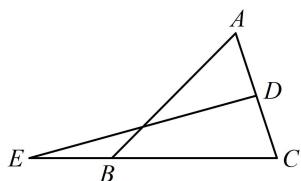

> [!faq]- 《第1节 向量的基本运算》参考答案
>
> > [!success]- **【答案】** $-\frac{1}{2} a + \frac{3}{2} b; \frac{\pi}{6}$
>
> > [!note]- **【分析】**
> > 本题未单列分析。
>
> > [!note]- **【解析】**
> > 解析：如图， $\overrightarrow{DE} = \overrightarrow{DC} +\overrightarrow{CE} = -\frac{1}{2}\overrightarrow{CA} +\frac{3}{2}\overrightarrow{CB} = -\frac{1}{2}\pmb {a} + \frac{3}{2}\pmb {b}$
> >
> > 
> >
> > 可发现 $\angle ACB$ 是 $a$ 与 $b$ 的夹角，可用 $a \cdot b$ 产生 $\cos \angle ACB$
> >
> > 而 $\angle ACB$ 最大即 $\cos \angle ACB$ 最小，故把 $\overrightarrow{AB}$ 也用 $a$ 和 $b$ 表
> >
> > 示，再用数量积翻译 $\overrightarrow{AB} \perp \overrightarrow{DE}$ ，解出 $\cos \angle ACB$ ，
> >
> > $\overrightarrow{AB} = \overrightarrow{CB} -\overrightarrow{CA} = \pmb {b} - \pmb{a}$ ，因为 $\overrightarrow{AB}\bot \overrightarrow{DE}$ ，所以 $\overrightarrow{AB}\cdot \overrightarrow{DE} =$
> >
> > $$
> > (\pmb {b} - \pmb {a}) \cdot \left(- \frac {1}{2} \pmb {a} + \frac {3}{2} \pmb {b}\right) = \frac {1}{2} \pmb {a} ^ {2} + \frac {3}{2} \pmb {b} ^ {2} - 2 \pmb {a} \cdot \pmb {b}
> > $$
> >
> > $$
> > = \frac {1}{2} | \boldsymbol {a} | ^ {2} + \frac {3}{2} | \boldsymbol {b} | ^ {2} - 2 | \boldsymbol {a} | \cdot | \boldsymbol {b} | \cdot \cos \angle A C B = 0,
> > $$
> >
> > $$
> > \cos \angle A C B = \frac {\left| \boldsymbol {a} \right| ^ {2} + 3 \left| \boldsymbol {b} \right| ^ {2}}{4 \left| \boldsymbol {a} \right| \cdot \left| \boldsymbol {b} \right|} = \frac {1}{4} \left(\frac {\left| \boldsymbol {a} \right|}{\left| \boldsymbol {b} \right|} + \frac {3 \left| \boldsymbol {b} \right|}{\left| \boldsymbol {a} \right|}\right) \geq \frac {1}{4} \times 2 \sqrt {\frac {\left| \boldsymbol {a} \right|}{\left| \boldsymbol {b} \right|} \cdot \frac {3 \left| \boldsymbol {b} \right|}{\left| \boldsymbol {a} \right|}}
> > $$
> >
> > $= \frac{\sqrt{3}}{2}$ ，取等条件是 $\frac{|a|}{|b|} = \frac{3|b|}{|a|}$ ，即 $|\pmb {a}| = \sqrt{3} |\pmb {b}|$
> >
> > 所以 $(\cos \angle ACB)_{\min} = \frac{\sqrt{3}}{2}$ ，故 $\angle ACB$ 的最大值为 $\frac{\pi}{6}$ .
> >
> > 一数·必刷100讲
