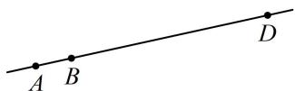

> [!faq]- 《第1节 向量的基本运算》例题解析
>
> > [!success]- **【答案】** 1
>
> > [!note]- **【分析】**
> > 本题未单列分析。
>
> > [!note]- **【解析】**
> > 解析：$A, B, D$ 三点共线可用向量共线翻译, 即存在 $\lambda$ 使 $\overrightarrow{AD} = \lambda \overrightarrow{AB}$ , 故将 $\overrightarrow{AD}$ 和 $\overrightarrow{AB}$ 用 $\vec{e}_1$ , $\vec{e}_2$ 表示,
> >
> > 由题意， $\overrightarrow{AD} = \overrightarrow{AB} +\overrightarrow{BC} +\overrightarrow{CD} = \overrightarrow{AB} +\overrightarrow{BC} -\overrightarrow{DC} = \vec{e}_1 + k\vec{e}_2 + 5\vec{e}_1 + 4\vec{e}_2 - (-\vec{e}_1 - 2\vec{e}_2) = 7\vec{e}_1 + (k + 6)\vec{e}_2$
> >
> > 如图，因为 $A, B, D$ 三点共线，所以 $\overrightarrow{AB}$ 与 $\overrightarrow{AD}$ 共线，故存在实数 $\lambda$ 使 $\overrightarrow{AD} = \lambda \overrightarrow{AB}$ ，
> >
> > 即 $7\vec{e}_1 + (k + 6)\vec{e}_2 = \lambda \vec{e}_1 + \lambda k\vec{e}_2$ ，所以 $\left\{ \begin{array}{l}7 = \lambda \\ k + 6 = \lambda k \end{array} \right.$ ，解得： $k = 1$
> >
> >
> > 
