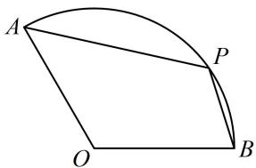

<!-- question-source:start -->
1. (★★★)

如图，扇形 AOB 的圆心角为 $120^{\circ}$ ，半径为 2，P 是圆弧 AB 上的动点，则 $\overrightarrow{PA} \cdot \overrightarrow{PB}$ 的最小值是 \_\_\_\_.

<!-- question-source:end -->

![[Q00050714A1]]
