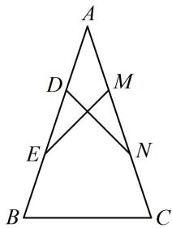

<!-- question-source:start -->
## 5.（2022·天津模拟·★★★）

如图, 在等腰 $\triangle ABC$ 中, $AB = AC = 3$ , $D$ , $E$ 与 $M$ , $N$ 分别是 $AB$ , $AC$ 的三等分点, 且 $\overrightarrow{DN} \cdot \overrightarrow{ME} = -1$ , 则 $\tan A = \_\_\_\_, \overrightarrow{AB} \cdot \overrightarrow{BC} = \_\_\_\_.$

<!-- question-source:end -->

![[Q00050718A1]]
