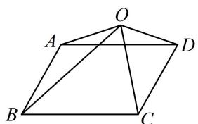

<!-- question-source:start -->
6. (2023·湖南九校联考·★★★☆)

如图， $O$ 是平行四边形ABCD所在平面内的一点，且满足 $\angle AOB = \frac{1}{2}\angle BOC = \frac{\pi}{6}, 2\sqrt{3}|\overrightarrow{OA}| = 2|\overrightarrow{OB}| = 3|\overrightarrow{OC}| = 6,$ 则 $\left|\overrightarrow{OD}\right| = (\quad)$ A.2 B. $\sqrt{3}$ C. $\sqrt{2}$ D.1

<!-- question-source:end -->

![[Q00050719A1]]
