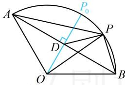

> [!faq]- 《第2节 数量积的常见几何方法》参考答案
>
> > [!success]- **【答案】** -2
>
> > [!note]- **【分析】**
> > 本题未单列分析。
>
> > [!note]- **【解析】**
> > 解析：$\overrightarrow{PA}$ ， $\overrightarrow{PB}$ 共起点，且底边长不变，故可用极化恒等式计算 $\overrightarrow{PA} \cdot \overrightarrow{PB}$ ，如图，设 $AB$ 中点为 $D$ ，由极化恒等式， $\overrightarrow{PA} \cdot \overrightarrow{PB} = |PD|^2 - |AD|^2$ ，而 $|AD| = |OA|\sin \angle AOD = 2\sin 60^\circ = \sqrt{3}$ ，所以 $\overrightarrow{PA} \cdot \overrightarrow{PB} = |PD|^2 - |AD|^2 = |PD|^2 - 3$ ①，故只需求 $|PD|$ 的最小值，由三角形两边之差小于第三边可知， $|PD| \geq |OP| - |OD| = |OP_0| - |OD| = |P_0D|$ ，故当 $P$ 与图中 $P_0$ 重合时， $|PD|$ 最小，且 $\left|PD\right|_{\min} = \left|P_0D\right| = \left|OP_0\right| - \left|OD\right| = 2 - \left|OA\right|\cos \angle AOD = 2 - 2\cos 60^\circ = 1$ ，代入①得 $\overrightarrow{PA} \cdot \overrightarrow{PB}$ 的最小值是-2.
> >
> > 
