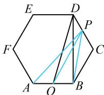

> [!faq]- 《第2节 数量积的常见几何方法》参考答案
>
> > [!success]- **【答案】** C
>
> > [!note]- **【分析】**
> > 本题未单列分析。
>
> > [!note]- **【解析】**
> > 解析：注意到 $\overrightarrow{PA}$ 与 $\overrightarrow{PB}$ 共起点，且底边长 AB 已知，故可考虑用极化恒等式来求 $\overrightarrow{PA} \cdot \overrightarrow{PB}$ ，再分析最值，设 AB 中点为 O，则由极化恒等式， $\overrightarrow{PA} \cdot \overrightarrow{PB} = OP^{2} - OA^{2} = OP^{2} - \frac{1}{4}$ ①，故只需求 OP 的最大值，可结合图形来看，
> > 如图，当 P 与 D 或 E 重合时，OP 最大，
> > 在 $\triangle BCD$ 中， $BC = CD = 1,\quad \angle BCD = 120^{\circ}$ 由余弦定理， $BD^{2}=BC^{2}+CD^{2}-2BC\cdot CD\cdot\cos\angle BCD=1^{2}+1^{2}-2\times1\times1\times\cos120^{\circ}=3$ 由图形的对称性， $BD \perp OB$ ，所以 $OD = \sqrt{OB^{2} + BD^{2}} = \sqrt{\left(\frac{1}{2}\right)^{2} + 3} = \frac{\sqrt{13}}{2}$ ，故 $OP_{max} = \frac{\sqrt{13}}{2}$ ，
> > 代入①得 $\overrightarrow{PA}\cdot\overrightarrow{PB}$ 的最大值为 $\left(\frac{\sqrt{13}}{2}\right)^{2}-\frac{1}{4}=3$ .
> >
> > 
