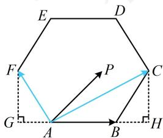

> [!faq]- 《第2节 数量积的常见几何方法》参考答案
>
> > [!success]- **【答案】** A
>
> > [!note]- **【分析】**
> > 本题未单列分析。
>
> > [!note]- **【解析】**
> > 解析：$\overrightarrow{AB}$ 不动， $\overrightarrow{AP}$ 在 $\overrightarrow{AB}$ 上的投影向量也容易分析，故用投影法，如图，作 $CH \perp AB$ 于 $H$ ， $FG \perp AB$ 于 $G$ ，为了便于阐述，先假设 $P$ 能取边界，则当 $P$ 与 $C$ 重合时， $\overrightarrow{AP}$ 在 $\overrightarrow{AB}$ 上的投影向量为 $\overrightarrow{AH}$ ，此时投影向量与 $\overrightarrow{AB}$ 同向且长度最大，且 $\left|\overrightarrow{AH}\right| = \left|\overrightarrow{AB}\right| + \left|\overrightarrow{BH}\right| = 2 + \left|\overrightarrow{BC}\right| \cos \angle CBH = 2 + 2\cos 60^\circ = 3$ ，故 $(\overrightarrow{AP} \cdot \overrightarrow{AB})_{\max} = \overrightarrow{AB} \cdot \overrightarrow{AH} = \left|\overrightarrow{AB}\right| \cdot \left|\overrightarrow{AH}\right| \cdot \cos 0^\circ = 2 \times 3 \times 1 = 6$ ；当 $P$ 与 $F$ 重合时， $\overrightarrow{AP}$ 在 $\overrightarrow{AB}$ 上的投影向量为 $\overrightarrow{AG}$ ，此时投影向量与 $\overrightarrow{AB}$ 反向且长度最大，且 $\left|\overrightarrow{AG}\right| = \left|\overrightarrow{AF}\right| \cos \angle FAG = 2\cos 60^\circ = 1$ ，所以 $(\overrightarrow{AP} \cdot \overrightarrow{AB})_{\min} = \overrightarrow{AB} \cdot \overrightarrow{AG} = \left|\overrightarrow{AB}\right| \cdot \left|\overrightarrow{AG}\right| \cdot \cos 180^\circ = 2 \times 1 \times (-1) = -2$ ；因为 $P$ 只能在正六边形 $ABCDEF$ 内部运动，不能取边界，所以 $\overrightarrow{AP} \cdot \overrightarrow{AB}$ 的取值范围是 $(-2,6)$ 。
> >
> > 
