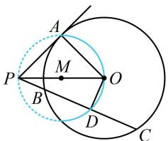
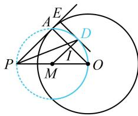

> [!faq]- 《第2节 数量积的常见几何方法》参考答案
>
> > [!success]- **【答案】** A
>
> > [!note]- **【分析】**
> > 本题未单列分析。
>
> > [!note]- **【解析】**
> > A
> > 解析：如图1，由题意， $|OA|=1$ ， $|PO|=\sqrt{2}$ ，
> > 所以 $\left|PA\right|=\sqrt{\left|PO\right|^{2}-\left|OA\right|^{2}}=1$ 注意到 $\overrightarrow{PA}$ 不变，可考虑通过分析 $\overrightarrow{PD}$ 在 $\overrightarrow{PA}$ 上的投影向量来求最值，故尝试找点 D 的轨迹，
> > 因为 D 为 BC 中点，所以 $OD \perp BC$ ，即 $\angle ODP = 90^{\circ}$ ，
> > 故点 D 在以 OP 为直径的圆 M 上运动（圆 O 内部分），
> > 所以当 D 位于如图 2 所示位置时， $\overrightarrow{PD}$ 在 $\overrightarrow{PA}$ 上的投影向量正向最长，其中 $DE \perp PA$ 且 DE 与圆 M 相切，
> >
> > 故 $(\overrightarrow{PA} \cdot \overrightarrow{PD})_{\max} = \overrightarrow{PA} \cdot \overrightarrow{PE} = |\overrightarrow{PA}| \cdot |\overrightarrow{PE}| = |\overrightarrow{PE}|$ ①,
> >
> > 设 $MD$ 与 $OA$ 交于点 $I$ ，因为 $MD \perp DE$ ， $PE \perp DE$ ，
> >
> > 所以 $MD \parallel PE$ ，结合 $M$ 是 $OP$ 中点可得 $I$ 是 $OA$ 中点，
> >
> > 所以 $\left|MI\right|=\frac{1}{2}\left|PA\right|=\frac{1}{2}$ ， $\left|ID\right|=\left|MD\right|-\left|MI\right|=\frac{\sqrt{2}-1}{2}$ ，
> >
> > 故 $\left|PE\right|=\left|PA\right|+\left|AE\right|=\left|PA\right|+\left|ID\right|=\frac{1+\sqrt{2}}{2}$ ，
> >
> > 代入①可得 $(\overrightarrow{PA} \cdot \overrightarrow{PD})_{\max} = \frac{1 + \sqrt{2}}{2}$ .
> >
> >   
> > 图1
> >
> >   
> > 图2
