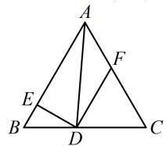

> [!faq]- 《第2节 数量积的常见几何方法》参考答案
>
> > [!success]- **【答案】** 详见解析
>
> > [!note]- **【分析】**
> > 本题未单列分析。
>
> > [!note]- **【解析】**
> > 1; $\frac{11}{20}$
> >
> > 解法1：如图， $D$ 在 $BC$ 上运动时， $BD$ 的长会随之而改变，故可设 $BD$ 的长，并用于计算其它长度，设 $\left|BD\right| = x(0 < x < 1)$ ，则 $\left|CD\right| = 1 - x$ 因为 $DF / / AB$ ，所以 $\triangle CDF$ 是正三角形，故 $\left|DF\right| = 1 - x$ 在 $\triangle BED$ 中， $\angle B = 60^{\circ}$ ， $DE\perp BE$ 所以 $\left|BE\right| = \left|BD\right|\cos \angle B = \frac{x}{2}$ ， $\left|DE\right| = \left|BD\right|\sin \angle B = \frac{\sqrt{3}}{2} x$
> >
> > 由 $DF \parallel AB$ 可知 $\overrightarrow{BE}$ 与 $\overrightarrow{DF}$ 同向，
> >
> > 所以 $\left|2\overrightarrow{BE} +\overrightarrow{DF}\right| = \left|2\overrightarrow{BE}\right| + \left|\overrightarrow{DF}\right| = 2\cdot \frac{x}{2} +1 - x = 1;$
> >
> > 再算 $(\overrightarrow{DE} + \overrightarrow{DF}) \cdot \overrightarrow{DA}$ ，考虑拆解法，虽然三角形已知，但尝试可发现若都往三角形边上分解会很麻烦，所以考虑将 $\overrightarrow{DA}$ 拆解成 $\overrightarrow{DE} + \overrightarrow{EA}$ 或 $\overrightarrow{DF} + \overrightarrow{FA}$ ，由于 $DE \perp AE$ ，故拆解成 $\overrightarrow{DE} + \overrightarrow{EA}$ 比较好算，
> >
> > $$
> > (\overrightarrow {D E} + \overrightarrow {D F}) \cdot \overrightarrow {D A} = (\overrightarrow {D E} + \overrightarrow {D F}) \cdot (\overrightarrow {D E} + \overrightarrow {E A}) = \overrightarrow {D E} ^ {2} + \overrightarrow {D E} \cdot \overrightarrow {E A} +
> > $$
> >
> > $$
> > \overrightarrow {D F} \cdot \overrightarrow {D E} + \overrightarrow {D F} \cdot \overrightarrow {E A} = \left(\frac {\sqrt {3}}{2} x\right) ^ {2} + \left| \overrightarrow {D F} \right| \cdot \left| \overrightarrow {E A} \right| \cdot \cos 0 ^ {\circ}
> > $$
> >
> > $$
> > = \frac {3}{4} x ^ {2} + (1 - x) \left(1 - \frac {x}{2}\right) = \frac {5}{4} x ^ {2} - \frac {3}{2} x + 1
> > $$
> >
> > $$
> > = \frac {5}{4} \left(x ^ {2} - \frac {6}{5} x\right) + 1 = \frac {5}{4} \left(x - \frac {3}{5}\right) ^ {2} + \frac {1 1}{2 0},
> > $$
> >
> > 所以当 $x = \frac{3}{5}$ 时， $(\overrightarrow{DE} +\overrightarrow{DF})\cdot \overrightarrow{DA}$ 取得最小值 $\frac{11}{20}$
> >
> > 解法2：求 $\left|2\overrightarrow{BE} +\overrightarrow{DF}\right|$ 的过程同解法1，
> >
> > $$
> > (\overrightarrow {D E} + \overrightarrow {D F}) \cdot \overrightarrow {D A} = \overrightarrow {D E} \cdot \overrightarrow {D A} + \overrightarrow {D F} \cdot \overrightarrow {D A} \quad ①,
> > $$
> >
> > 观察图形发现 $\overrightarrow{DA}$ 在 $\overrightarrow{DE}$ 上的投影向量是 $\overrightarrow{DE}$ ，而 $DF // AB$ ，所以 $\overrightarrow{DA}$ 在 $\overrightarrow{DF}$ 和 $\overrightarrow{BA}$ 上的投影向量相等，都是 $\overrightarrow{EA}$ ，故两个投影向量都好找，用投影法算数量积较方便，
> >
> > $$
> > \overrightarrow {D E} \cdot \overrightarrow {D A} = \overrightarrow {D E} ^ {2} = \frac {3}{4} x ^ {2}, \quad \overrightarrow {D F} \cdot \overrightarrow {D A} = \overrightarrow {D F} \cdot \overrightarrow {E A} = | \overrightarrow {D F} | \cdot | \overrightarrow {E A} |
> > $$
> >
> > $$
> > = (1 - x) \left(1 - \frac {x}{2}\right) = 1 - \frac {3}{2} x + \frac {x ^ {2}}{2},
> > $$
> >
> > 代入①得 $(\overrightarrow{DE} + \overrightarrow{DF}) \cdot \overrightarrow{DA} = \frac{5}{4} x^2 - \frac{3}{2} x + 1 = \frac{5}{4}\left(x - \frac{3}{5}\right)^2 + \frac{11}{20}$
> >
> > 故当 $x = \frac{3}{5}$ 时， $(\overrightarrow{DE} +\overrightarrow{DF})\cdot \overrightarrow{DA}$ 取得最小值 $\frac{11}{20}$
> >
> > 
>
> > [!tip]- **【反思】**
> > 拆解法也不一定是往边上拆，从解法1可发现，本题 $\overrightarrow{DE}$ ， $\overrightarrow{EA}$ 垂直且长度可算，往它们拆解更好.
