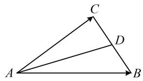
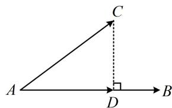

<!-- source-part:1 pages:1-5 -->

# 第2节 数量积的常见几何方法（★★★）

内容提要

用定义计算向量的数量积是基本方法，但有一定的局限性，本节我们归纳几种数量积的几何计算方法.

1. 极化恒等式：如图1，设 $D$ 为 $BC$ 中点，则 $\overrightarrow{AB} \cdot \overrightarrow{AC} = (\overrightarrow{AD} + \overrightarrow{DB}) \cdot (\overrightarrow{AD} + \overrightarrow{DC})$ ，因为 $\overrightarrow{DC} = -\overrightarrow{DB}$ ，所以 $\overrightarrow{AB} \cdot \overrightarrow{AC} = (\overrightarrow{AD} + \overrightarrow{DB}) \cdot (\overrightarrow{AD} - \overrightarrow{DB}) = |AD|^2 - |BD|^2$ ，这一结论叫做极化恒等式，它常用于计算共起点、底边长已知的两个向量的数量积，其好处是把本来需要夹角才能计算的数量积转化成只需长度即可计算的量.

  
图1

  
图2

2. 投影法：如图 2, $CD \perp AB$ ，则 $\overrightarrow{AB} \cdot \overrightarrow{AC} = \overrightarrow{AB} \cdot (\overrightarrow{AD} + \overrightarrow{DC}) = \overrightarrow{AB} \cdot \overrightarrow{AD} + \overrightarrow{AB} \cdot \overrightarrow{DC} = \overrightarrow{AB} \cdot \overrightarrow{AD}$ ，我们把 $\overrightarrow{AD}$ 叫做 $\overrightarrow{AC}$ 在 $\overrightarrow{AB}$ 上的投影向量，上述求数量积的方法叫做投影法。当两个向量中一个不变，另一个在该向量上的投影向量容易分析时，用投影法求数量积很方便。

3. 拆解法: 若图形中有两个不共线的向量既知道长度, 又知道夹角, 不妨选择它们作为基底, 把求数量积的向量都用这组基底表示, 从而转化为基向量的数量积来算.

![[高中/总复习/教辅/一数常规版2026/第6章 平面向量/第2节 数量积的常见几何方法/类型01_极化恒等式/类型01_极化恒等式.md]]
![[高中/总复习/教辅/一数常规版2026/第6章 平面向量/第2节 数量积的常见几何方法/类型02_投影法/类型02_投影法.md]]
![[高中/总复习/教辅/一数常规版2026/第6章 平面向量/第2节 数量积的常见几何方法/类型03_拆解法/类型03_拆解法.md]]
![[高中/总复习/教辅/一数常规版2026/第6章 平面向量/第2节 数量积的常见几何方法/强化训练/强化训练.md]]
