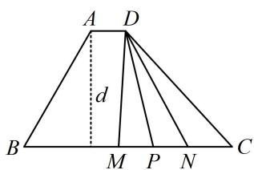

> [!faq]- 《第2节 数量积的常见几何方法》例题解析
>
> > [!success]- **【答案】** 11
>
> > [!note]- **【分析】**
> > 本题未单列分析。
>
> > [!note]- **【解析】**
> > 解析：$\overrightarrow{DM}$ 与 $\overrightarrow{DN}$ 共起点，且底边长已知，符合极化恒等式的使用场景，先取中点，
> >
> > 如图，设 $MN$ 的中点为 $P$ ，由极化恒等式， $\overrightarrow{DM}\cdot \overrightarrow{DN} = |\overrightarrow{DP}|^2 -|\overrightarrow{MP}|^2 = |\overrightarrow{DP}|^2 -1,$ 故只需求 $\left|\overrightarrow{DP}\right|$ 的最小值，由图可知，当 $DP\bot BC$ 时， $\left|\overrightarrow{DP}\right|$ 最小，所以 $\left|\overrightarrow{DP}\right|$ 的最小值即为平行线 $AD$ 和 $BC$ 之间的距离 $d$ 而 $d = |AB|\sin \angle B = 4\sin 60^{\circ} = 2\sqrt{3}$ ，所以 $(\overrightarrow{DM}\cdot \overrightarrow{DN})_{\min} = (2\sqrt{3})^2 -1 = 11.$
> >
> > 
