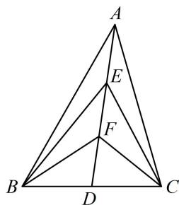

> [!faq]- 《第2节 数量积的常见几何方法》例题解析
>
> > [!success]- **【答案】** $\frac{7}{8}$
>
> > [!note]- **【分析】**
> > 本题未单列分析。
>
> > [!note]- **【解析】**
> > 解析：题目中的三个数量积共起点，底边均为 $BC$ ，相当于底边不变，可用极化恒等式算这些数量积，
> >
> > 
> >
> > 设 $|AE|=|EF|=|FD|=x$ ， $|BD|=|CD|=y$ ，则由极化恒等式，
> >
> > $\left\{ \begin{array}{l} \overrightarrow{BA} \cdot \overrightarrow{CA} = |AD|^2 - |BD|^2 = 9x^2 - y^2 = 4 \\ \overrightarrow{BF} \cdot \overrightarrow{CF} = |FD|^2 - |BD|^2 = x^2 - y^2 = -1 \end{array} \right. \Rightarrow x^2 = \frac{5}{8}, \quad y^2 = \frac{13}{8}$ ，所以 $\overrightarrow{BE} \cdot \overrightarrow{CE} = |ED|^2 - |BD|^2 = 4x^2 - y^2 = \frac{7}{8}$ .
>
> > [!tip]- **【总结】**
> > 用极化恒等式求数量积常有两个特征：①共起点；
> > - **②**：底边长已知，或中线、底边易求.
