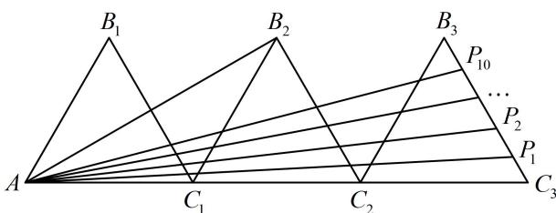

<!-- question-source:start -->
【变式】如图，三个边长为2的等边三角形有一条边在同一条直线上，边 $B_{3}C_{3}$ 上有10个不同的点 $P_{1},P_{2},\cdots,P_{10}$ ，记 $m_{i}=\overrightarrow{AB_{2}}\cdot\overrightarrow{AP_{i}}(i=1,2,\cdots,10)$ ，则 $m_{1}+m_{2}+\cdots+m_{10}$ 的值为（）

A. 180    B. $60\sqrt{3}$ C. 45    D. $15\sqrt{3}$

<!-- question-source:end -->

![[高中/总复习/教辅/一数常规版2026/第6章 平面向量/第2节 数量积的常见几何方法/类型02_投影法/例题/answers/Q00050333A1.md]]
